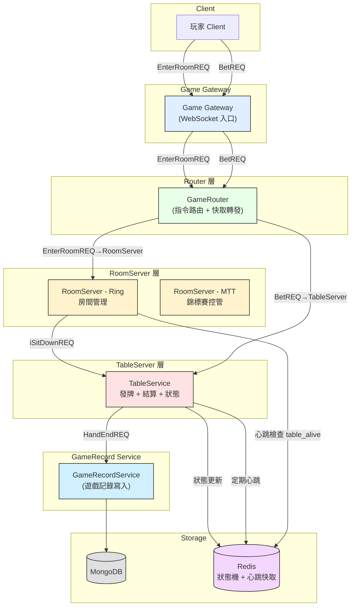

```mermaid
flowchart TD

subgraph Client [Client]
    C1[玩家 Client]
end

subgraph Gateway [Game Gateway]
    GW["Game Gateway<br/>(WebSocket 入口)"]
end

subgraph Router [Router 層]
    RR["GameRouter<br/>(指令路由 + 快取轉發)"]
end

subgraph RoomServer [RoomServer 層]
    RS1["RoomServer - Ring<br/>房間管理"]
    RS2["RoomServer - MTT<br/>錦標賽控管"]
end

subgraph TableServer [TableServer 層]
    T1["TableService<br/>發牌 + 結算 + 狀態"]
end

subgraph GameRecordService [GameRecord Service]
    GR["GameRecordService<br/>(遊戲記錄寫入)"]
end

subgraph Storage [Storage]
    DB[(MongoDB)]
    REDIS[(Redis<br/>狀態機 + 心跳快取)]
end

%% 玩家進入房間
C1 -->|EnterRoomREQ| GW
GW -->|EnterRoomREQ| RR
RR -->|EnterRoomREQ→RoomServer| RS1
RS1 -->|iSitDownREQ| T1

%% 遊戲進行中的請求
C1 -->|BetREQ| GW
GW -->|BetREQ| RR
RR -->|BetREQ→TableServer| T1

%% TableServer 狀態更新
T1 -->|狀態更新| REDIS
T1 -->|定期心跳| REDIS

%% 資料寫入由 GameRecordService 處理
T1 -->|HandEndREQ| GR
GR --> DB

%% RoomServer 健康檢查
RS1 -->|心跳檢查 table_alive| REDIS

%% 顏色樣式
style GW fill:#dfefff,stroke:#000
style RR fill:#e8ffe8,stroke:#000
style RS1 fill:#fff3cd,stroke:#000
style RS2 fill:#fff3cd,stroke:#000
style T1 fill:#ffe2e2,stroke:#000
style REDIS fill:#f3d7ff,stroke:#000
style DB fill:#e0e0e0,stroke:#000
style GR fill:#d0f0ff,stroke:#000
```