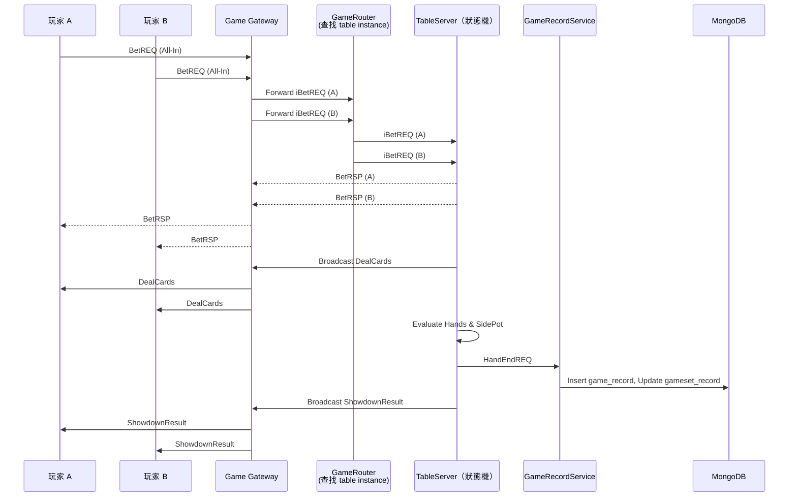

# 雙方 All-In（BetREQ）處理流程說明

當兩名玩家（A 與 B）在同一局遊戲中進行 All-In，系統將啟動完整的下注、發牌、勝負判定、紀錄寫入、廣播等流程。本文件描述此流程中每個模組的責任範疇與異常處理。

---

## 🎯 架構設計重點

- 所有狀態由 `TableServer` 控制並具有內部狀態機
- 路由與服務發現交由 `GameRouter` 管理
- 資料寫入經由 `GameRecordService` 統一處理，避免 TableServer 操作資料庫造成 I/O 過重

---

## 🧩 All-In 處理流程（BRC 模型）

