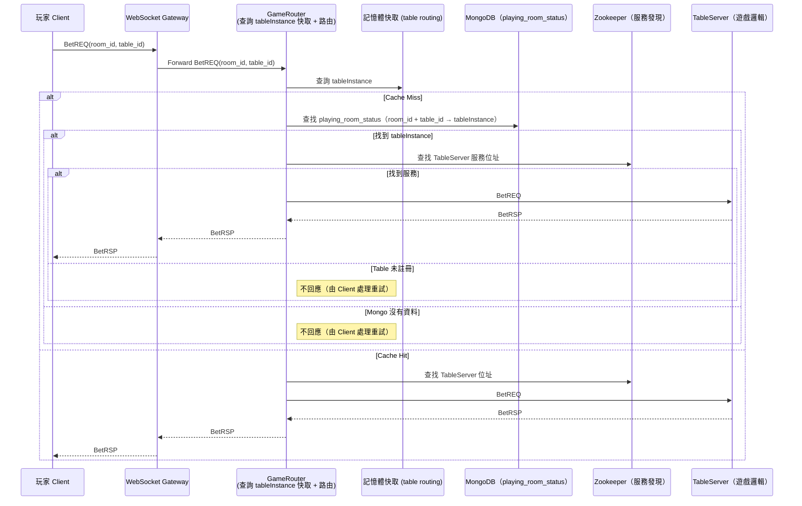

# BetREQ 請求處理流程

本文件描述玩家下注（BetREQ）時，如何透過 Gateway → GameRouter → TableServer 的分層架構進行路由、快取查找與服務發現。目的是在保證高可用下，快速且正確將指令導入對應的遊戲執行實例（TableServer）。

---

## 🎯 架構設計目標

- ❄️ Gateway 輕量處理：不保管任何狀態，只負責收發封包
- 🚦 GameRouter 多層緩存：支援 Cache / MongoDB fallback / Zookeeper 查找
- 🎲 TableServer 為唯一遊戲邏輯執行單位
- 🔁 支援 tableServer crash 自我修復與 client 端 retry

---

## 🧩 請求流程圖

