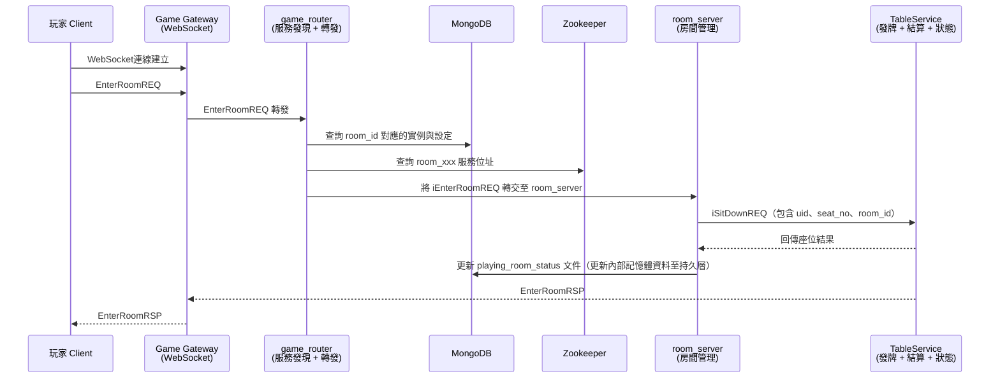

# EnterRoomREQ 進房請求處理流程

本文件描述玩家進入德州撲克房間時的整體流程，涵蓋指令傳遞、房間路由、座位分配與回應邏輯。透過 game_router 解耦 Gateway 與 room_server，並配合服務發現與資料持久化達成高可用與可觀察性。

---

## 🎯 架構設計目標

- 🧭 game_router 負責進房指令統一入口與服務定位
- 🏠 room_server 進行座位邏輯、與 Table 協同工作
- 🧠 Mongo 為房間狀態的持久化來源
- 🎲 Table 服務專注於遊戲狀態與玩家管理
- 🎯 玩家最終由 Table 服務回應結果

---

## 🧩 請求流程圖

