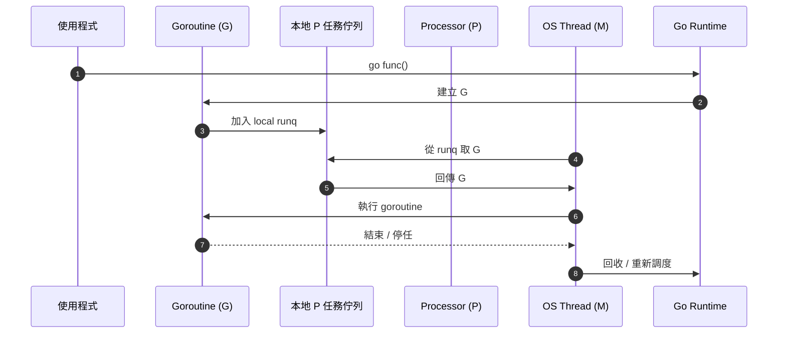
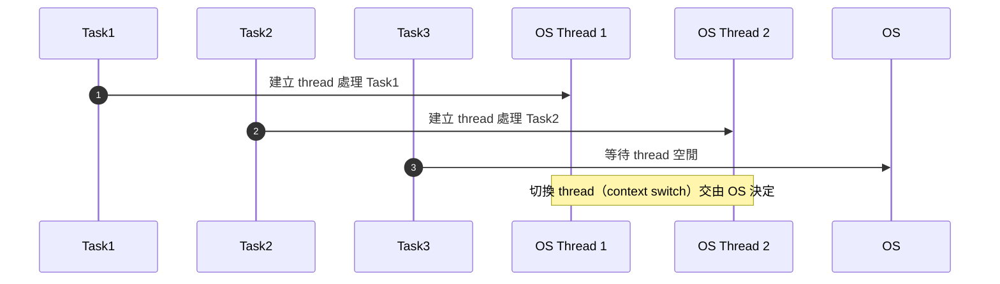
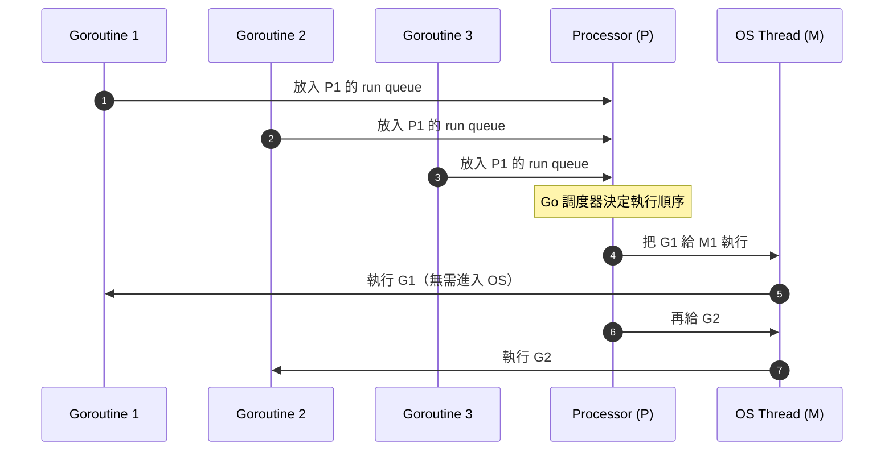
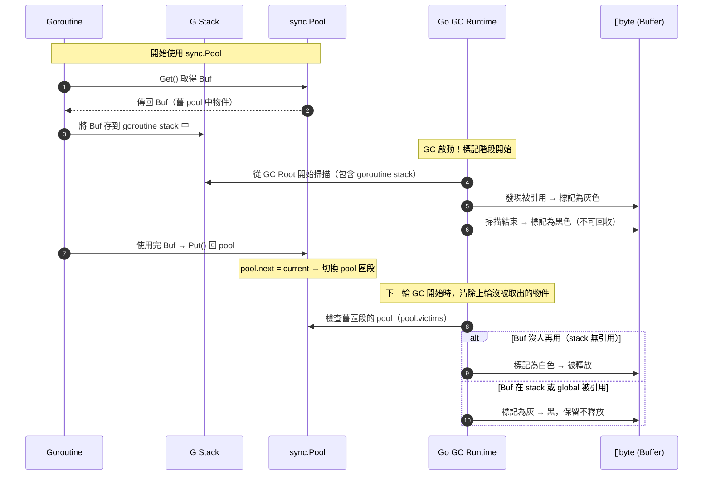
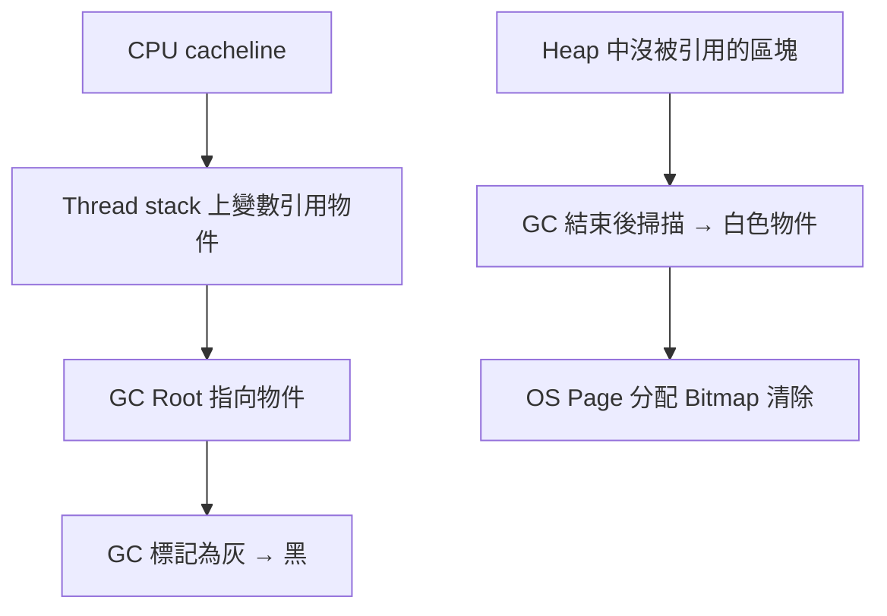

# Golang GMP 調度模型全解 (Goroutine, M, P)

## 目錄
- 什麼是 GMP 模型
- G/M/P 是什麼？
- GMP 的調度流程
- GOMAXPROCS 與 P 關係
- GC 與 goroutine 關聯性
- pprof/火焰圖 分析行為
- 優化實施措施

---

## 什麼是 GMP 模型
GMP 是 Go runtime 的調度模型，用來管理 goroutine（軟體執行單元）與 OS thread 之間的執行與調度關係。

---

## G/M/P 是什麼？

| 符號 | 內容 |
|------|------|
| G (Goroutine) | Go 軟體線程，由 runtime 管理 |
| M (Machine) | OS 執行緒，實際執行 G 的載體 |
| P (Processor) | 虛擬處理器，持有執行環境與 G 任務佇列 |

---

## GMP 調度流程

---
## OS Thread 調度（傳統做法，如 Java）

---
##  Go GMP 模型調度

---
## 三色標記

