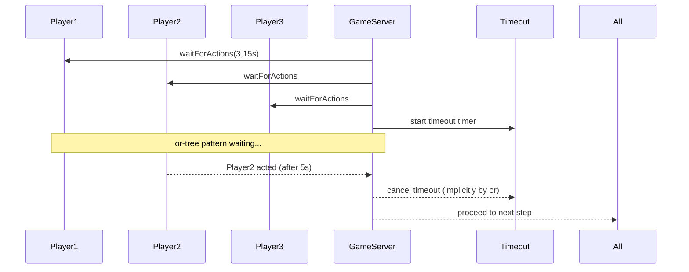

# 📦 Golang Channel 重點整理

---

## 🧠 Channel 是什麼？

- Golang 中內建的 goroutine 通訊機制，基於 CSP（Communicating Sequential Processes）模型。
- 透過 channel 可在 goroutine 間安全地傳遞資料，避免 race condition。
- 支援同步（無緩衝）與非同步（有緩衝）模式。
- 宣告方式：
  ```go
  ch := make(chan int)        // 無緩衝 channel
  ch := make(chan int, 5)     // 有緩衝 channel，容量為 5
  ```

---

## 🔄 Channel 操作（語法）

| 操作             | 說明                                  |
|------------------|---------------------------------------|
| `ch <- x`        | 將資料傳送到 channel（送端）           |
| `x := <-ch`      | 從 channel 接收資料（收端）             |
| `close(ch)`      | 關閉 channel，通知接收端資料已傳送完畢  |
| `x, ok := <-ch`  | 接收資料與狀態，若 channel 已關閉則 ok 為 false |

---

## 📦 有緩衝 vs 無緩衝 channel

| 類型       | 行為說明                                               |
|------------|--------------------------------------------------------|
| 無緩衝     | 發送與接收需同時發生，否則阻塞                         |
| 有緩衝     | 發送資料時會進 buffer，buffer 滿時才阻塞；接收消耗 buffer |

```go
ch := make(chan int, 2)
ch <- 1  // OK
ch <- 2  // OK
ch <- 3  // 阻塞，因為緩衝區滿了
```

---

## ⏱️ select 語法（多路監聽）

```go
select {
case msg := <-ch1:
    fmt.Println("收到 ch1:", msg)
case ch2 <- 42:
    fmt.Println("送出 42 到 ch2")
default:
    fmt.Println("沒有操作成功，進入 default")
}
```

- 用於同時監聽多個 channel。
- `default` 可防止阻塞。
- 任一條件成立就會執行該分支，隨機選中一個可執行的分支。

---

## ⚠️ 常見問題與陷阱

| 問題類型       | 範例 / 行為                                     |
|----------------|-------------------------------------------------|
| 重複 close     | 會 panic                                         |
| 向已關閉發送   | 會 panic                                         |
| 沒人接收       | 發送會永久阻塞，造成死鎖                        |
| goroutine 泄漏 | channel 沒被正確關閉或接收端沒退出              |
| range 卡住     | 沒有 close channel，導致 `range` 永遠不結束     |

---

## 💡 最佳實務建議

- ✅ 所有 channel 寫入都要有對應的接收。
- ✅ 使用 `close()` 正確關閉 channel，讓 `range` 結束。
- ✅ 避免重複 close，同一個 channel 只能關閉一次。
- ✅ 搭配 `select` 與 `time.After` 實現 timeout 控制。
- ✅ 搭配 `context` 管理 goroutine 與 channel 的生命週期。
- ✅ 使用 `sync.WaitGroup` 控制 goroutine 結束時機。
- ✅ 單向 channel 增加可讀性與安全性。

---

## 🧪 補充：單向 Channel

```go
func producer(ch chan<- int) {
    ch <- 10
}

func consumer(ch <-chan int) {
    val := <-ch
    fmt.Println(val)
}
```

| 型別         | 限制方向   |
|--------------|------------|
| `chan<- int` | 只允許寫入 |
| `<-chan int` | 只允許讀取 |

---

## 🧠 面試常見題

- channel 與 goroutine 如何實現並發模型？
- 有緩衝與無緩衝 channel 的差異與應用場景？
- 如何設計一個 timeout 的 channel 接收？
- channel 要不要關？什麼時候該關？
- 如何正確使用 select？
- 如何處理 channel 死鎖與 goroutine 泄漏？
- 單向 channel 的使用情境？

---

## 🧪 補充：如何觀察 channel 狀況與 goroutine 洩漏

```go
runtime.NumGoroutine() // 查看目前 goroutine 數量
pprof.Lookup("goroutine").WriteTo(os.Stdout, 1) // 輸出堆疊資訊
```

> 📌 Golang 的並發核心哲學：「不要用共享記憶體來通訊，而要用通訊來共享記憶體」。

---

## 🧩 or‑tree Pattern 摘要

https://www.linkedin.com/pulse/combine-or-channel-patterns-like-go-expert-advanced-archit-agarwal-w0b9c/
文章中提出的高效 or() 實作採用「分治」 (divide-and-conquer) 的方式，以遞迴方式兩兩合併 channel，稱為 or‑tree pattern。這種結構能大幅減少 goroutine 數量與資源消耗，更適合多 channel 情境。

```go
func or(channels ...<-chan struct{}) <-chan struct{} {
    switch len(channels) {
    case 0:
        return nil
    case 1:
        return channels[0]
    case 2:
        out := make(chan struct{})
        go func() {
            select {
            case <-channels[0]:
            case <-channels[1]:
            }
            close(out)
        }()
        return out
    default:
        mid := len(channels) / 2
        left := or(channels[:mid]...)
        right := or(channels[mid:]...)
        return or(left, right)
    }
}
```

