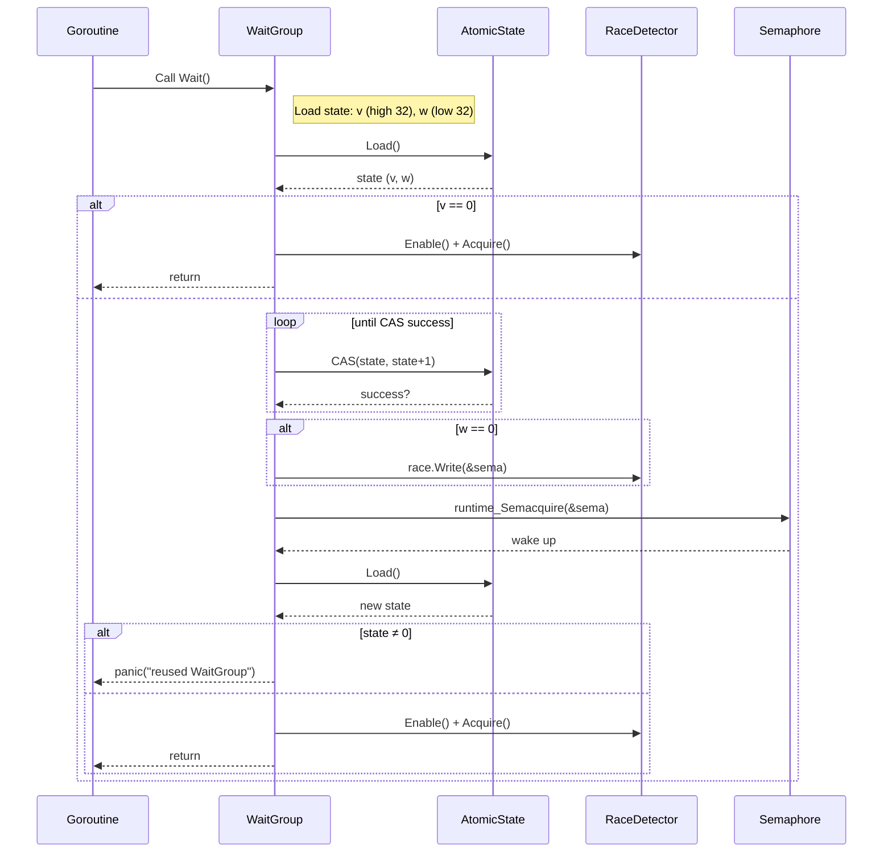

```mermaid
sequenceDiagram
    participant Caller as Goroutine
    participant WaitGroup
    participant AtomicState
    participant RaceDetector
    participant Semaphore

    Caller->>WaitGroup: Call Wait()
    Note right of WaitGroup: Load state: v (high 32), w (low 32)
    WaitGroup->>AtomicState: Load()
    AtomicState-->>WaitGroup: state (v, w)

    alt v == 0
        WaitGroup->>RaceDetector: Enable() + Acquire()
        WaitGroup-->>Caller: return
    else
        loop until CAS success
            WaitGroup->>AtomicState: CAS(state, state+1)
            AtomicState-->>WaitGroup: success?
        end

        alt w == 0
            WaitGroup->>RaceDetector: race.Write(&sema)
        end

        WaitGroup->>Semaphore: runtime_Semacquire(&sema)
        Semaphore-->>WaitGroup: wake up

        WaitGroup->>AtomicState: Load()
        AtomicState-->>WaitGroup: new state

        alt state ≠ 0
            WaitGroup-->>Caller: panic("reused WaitGroup")
        else
            WaitGroup->>RaceDetector: Enable() + Acquire()
            WaitGroup-->>Caller: return
        end
    end
```