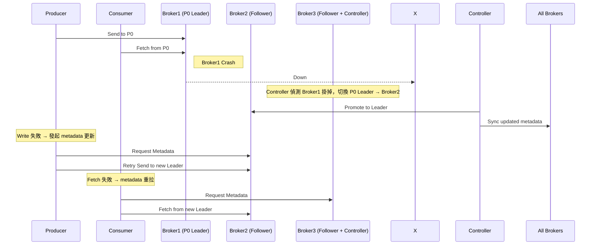

# Kafka Failover and Recovery

Kafka 是為了容錯與高可用設計的分散式系統，具備強大的自我修復能力。  
本文件將介紹 Kafka 如何在 broker、partition、controller 發生故障時進行 failover，以及如何恢復正常狀態。

---

## 1. Kafka 的高可用架構基礎

- 每個 topic 被分割為多個 partitions
- 每個 partition 有多個副本（replicas），包含：
  - 1 個 Leader（接收讀寫請求）
  - N 個 Follower（作為備援）
- Kafka Controller 負責監控 broker 狀態與 leader 分配

---

## 2. Broker 故障（Partition Leader Failover）

### 🧭 流程圖：Partition Leader 故障轉移

