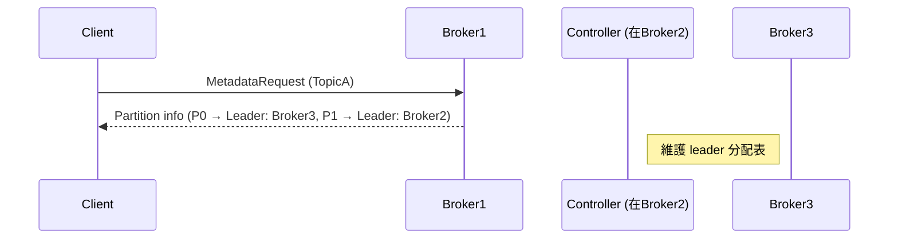

## 用戶端取得連線

```mermaid
sequenceDiagram
  participant Client
  participant Broker1
  participant Controller (在Broker2)
  participant Broker3

  Client->>Broker1: MetadataRequest (TopicA)
  Broker1-->>Client: Partition info (P0 → Leader: Broker3, P1 → Leader: Broker2)

  Note right of Controller (在Broker2): 維護 leader 分配表
```