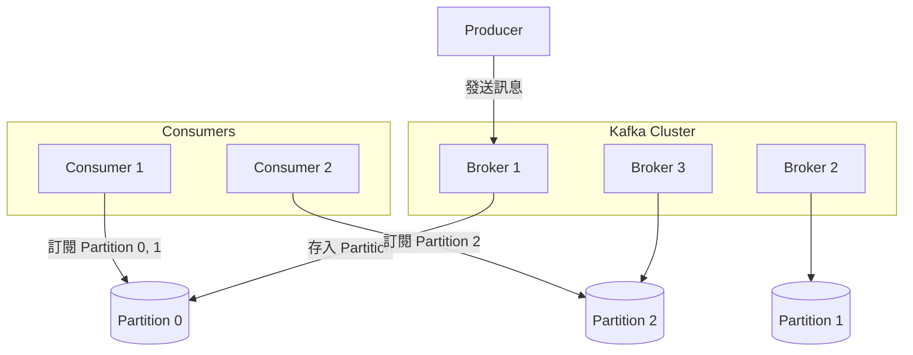
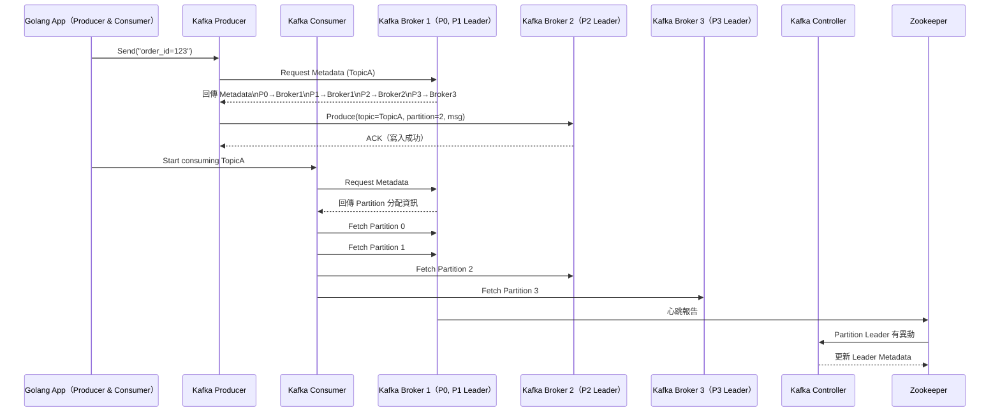

# 📦 Kafka 架構總覽：分散式日誌系統設計指南

Apache Kafka 是一個高吞吐量、分散式的串流平台，常被應用於即時資料處理、事件驅動架構與系統解耦合。

---

## ⚙ Kafka 核心組件

| 組件        | 說明                                                                 |
|-------------|----------------------------------------------------------------------|
| Producer    | 將資料寫入 Kafka Topic                                               |
| Consumer    | 從 Kafka Topic 中讀取資料                                            |
| Broker      | Kafka 伺服器節點，負責接收、儲存與傳遞訊息                           |
| Topic       | 類似資料分類的頻道，資料寫入時會指定 topic                          |
| Partition   | Topic 的子單位，支援平行處理與分區容錯                               |
| Offset      | 每個 Partition 中訊息的編號，用於追蹤 Consumer 消費進度             |
| Zookeeper   | 舊版 Kafka 的 metadata 管理（現已可用 KRaft 模式取代）              |
| Controller  | Kafka Cluster 中負責 leader election 與 partition assignment 的節點 |

---

## 🧠 Kafka 特性

- **高可用與容錯設計**：每個 partition 可設定 replica 數量，leader 掛掉可自動 failover。
- **可擴展性**：水平擴展節點與 partition 提高吞吐量。
- **耐久性與日誌式儲存**：資料寫入磁碟，可設定保留期限或大小。
- **強順序性（Partition 內部）**：保證同一 Partition 的訊息順序。
- **Consumer Group 支援**：多 Consumer 可協作處理同一 Topic，分攤負載。

---

## 🎯 適合應用場景

| 應用情境           | 說明                                               |
|--------------------|----------------------------------------------------|
| 即時資料串流       | 日誌收集、即時監控、clickstream 分析               |
| 微服務架構解耦     | 各服務以事件串流交互，降低耦合                     |
| 金融交易系統       | 具容錯、持久性的訊息佇列                           |
| 數據湖資料管道     | Kafka 作為資料進入大數據系統（如 Hadoop/Spark）的管道 |
| 訊息轉換中介       | 作為異質系統的轉發與標準化介面                     |

---

## 🔁 Kafka 架構圖（簡化）

---

# 🧠 Kafka 架構全景互動圖（Golang 視角）

