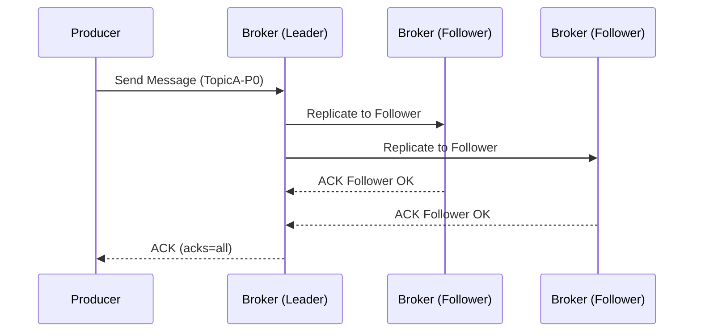

# Kafka Reliability – Kafka 如何設計可靠性機制

Kafka 是一個具備高可用與可靠性的分散式訊息平台，其可靠性設計主要涵蓋三大核心：

1. Partition 副本同步機制（Replication + ISR）
2. Producer 寫入確認機制（ACKs + min.insync.replicas）
3. 寫入去重與恰好一次（Idempotence + Transaction）

---

## 1. Partition 複本與 Leader 機制

Kafka 為每個 Partition 維護多個副本（replica），包含：

- **Leader replica**：唯一負責寫入與讀取
- **Follower replicas**：從 Leader 同步資料（非主動服務）

Kafka 保證只要 ISR（In-Sync Replicas）中還有一個存活副本，就不會遺失訊息。

```text
TopicA - Partition 0
Leader: Broker 1
Follower: Broker 2, Broker 3
ISR: [Broker1, Broker2]
```
---
## Producer 寫入流程（三層保護）

