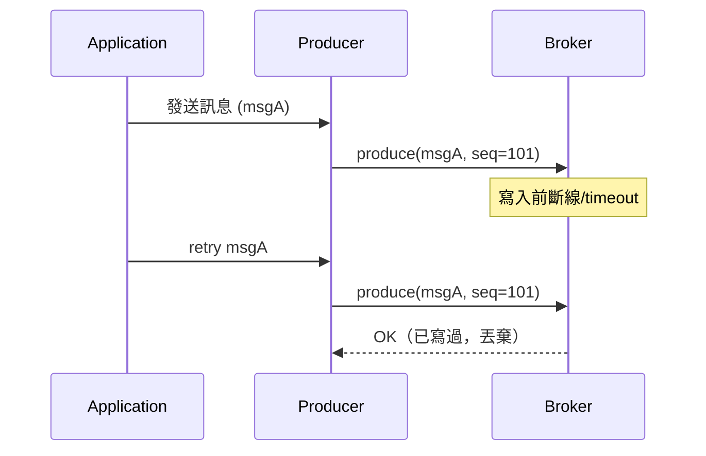
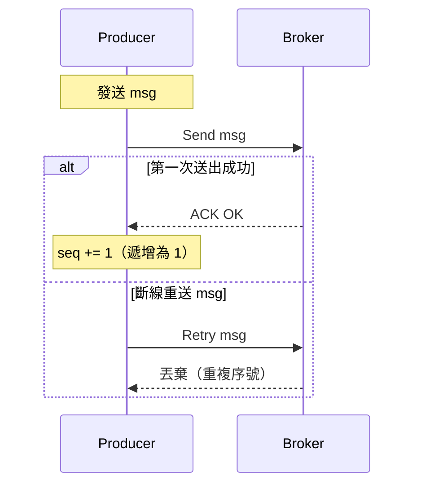

# ✨ Kafka 幂等性機制 (`enable.idempotence=true`)

Kafka Producer 的幂等性設定可以有效避免重送造成的**重複寫入問題**，在高併發與網路異常情況下提供更安全的訊息寫入保證。

---

## ✅ 功能說明

| 機制                    | 說明                                                                 |
|-------------------------|----------------------------------------------------------------------|
| `Producer ID` (PID)     | Kafka Broker 為每個 Producer 分配唯一 ID，以識別訊息來源。            |
| `Sequence Number`       | 每筆訊息都附帶遞增序號，Broker 會檢查序號，避免處理舊訊息。           |
| Exactly-Once-In-Partition (EoPi) | 確保同一 Partition 內訊息僅寫入一次，即使 Producer 重送。      |

---

## 🎯 適合場景

- 金流記錄（如：扣款、加值）
- 遊戲積分寫入
- 訂單狀態變更
- 高可靠性資料管道

---

## ⚠ 限制與注意事項

- 幂等性僅保證 *Partition 層級* 的「Exactly Once」
- 無法處理跨 Partition 的去重（需用 Transaction 機制）
- 開啟後將自動強制以下設定：
  - `acks=all`
  - `retries > 0`
  - `max.in.flight.requests.per.connection <= 5`

---

## 🧪 幂等 Producer 寫入流程

---

## 🔁 Kafka Producer 序號控制流程

---

# ⚖ Kafka `idempotence` vs Redis 分布式鎖：可靠寫入的兩種策略

## ✅ Kafka `idempotence`

| 特點                       | 說明                                                   |
|----------------------------|--------------------------------------------------------|
| 系統級保障                 | Kafka 內建，透過 Producer ID + Sequence Number 保證    |
| 適合用於                   | 交易系統、任務投遞、不可重複消費的事件流                 |
| 保證層級                   | 重送不會重複，Ordering 保持（前提：同 partition）        |
| 搭配設定                   | 需配合 `acks=all`, `max.in.flight <= 5`, 開啟 retries    |
| 缺點                       | 吞吐量會下降，延遲會提升                                |

---

## ✅ Redis 分布式鎖 + 自訂邏輯去重（如 SETNX）

| 特點                       | 說明                                                    |
|----------------------------|---------------------------------------------------------|
| 客製控制                   | 程式碼自行控制執行流程與重入邏輯                          |
| 適合用於                   | 精簡快速處理、單點鎖控制，如 API 請求控制、資源互斥        |
| 保證層級                   | 執行邏輯由你自己定義（需保證資料一致性與清除鎖機制）         |
| 缺點                       | 易踩坑：鎖遺失、鎖未釋放、非原子操作需額外處理               |
| 快速實作範例               | 使用 `SET key val NX PX 3000` 實作 Redis 鎖                |

---

## 🚀 結論建議

| 情境類型     | 建議使用方案           |
|--------------|------------------------|
| 高並發 & 高一致性要求 | Kafka `idempotence` |
| 快速簡單任務鎖定       | Redis 分布式鎖      |
| 任務執行有重入風險     | Redis + ID 去重邏輯 |