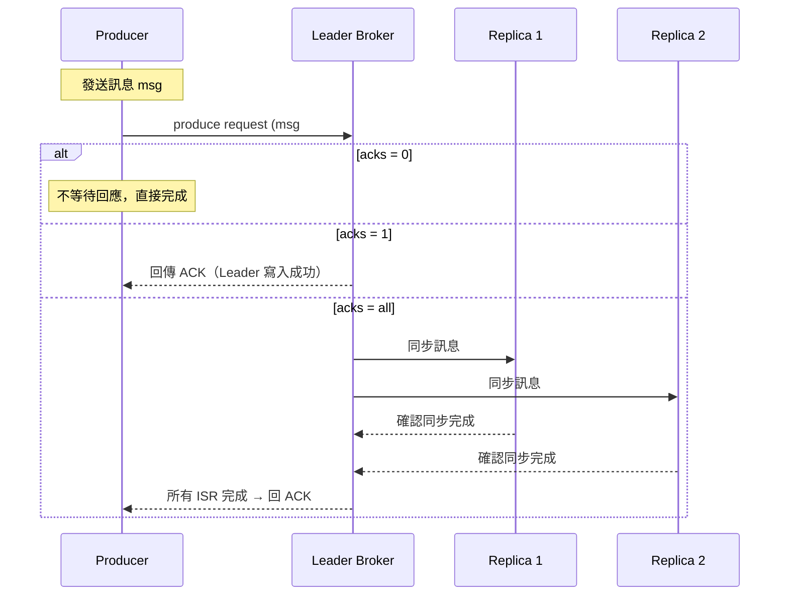
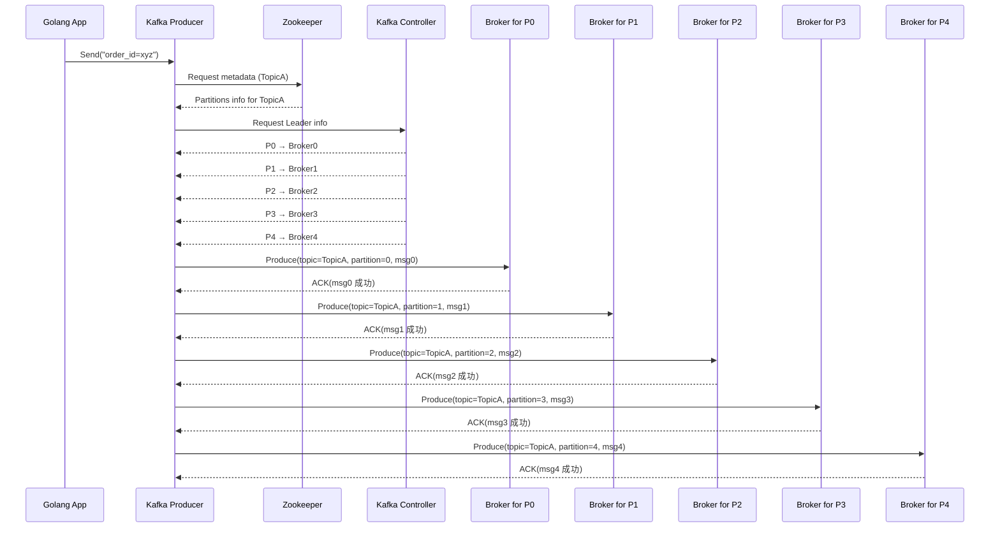

# 🛠 Kafka Producer Config 設定指南

本文件說明 Kafka Producer 常用的設定選項與其效能、可靠性上的意涵，幫助你根據業務需求調整參數以達到最佳效能與穩定性。

---

## ⚙️ 核心設定參數說明

| 參數名稱            | 預設值     | 說明                                                                 |
|---------------------|------------|----------------------------------------------------------------------|
| `acks`              | `1`        | **回應等級**：`0`, `1`, `all`，決定需等待幾個 Broker 回應才視為成功 |
| `retries`           | `0`        | **重試次數**：訊息傳送失敗時的最大重試次數                         |
| `retry.backoff.ms`  | `100`      | **重試間隔時間**（毫秒）                                             |
| `batch.size`        | `16384`    | 一批訊息的最大總 byte 數（不是筆數）                               |
| `linger.ms`         | `0`        | **延遲時間**（毫秒），Producer 等待更多訊息來湊 batch               |
| `compression.type`  | `none`     | 壓縮方式：`none`, `gzip`, `snappy`, `lz4`, `zstd`                   |
| `buffer.memory`     | `33554432` | Producer buffer 可用記憶體（byte）                                  |
| `max.in.flight.requests.per.connection` | `5` | 同時尚未回應的 request 數量                                          |
| `enable.idempotence`| `false`    | 啟用後避免重複送出（Exactly-once）                                  |
| `key.serializer`    | 必填       | Key 的序列化器，如：`StringSerializer`                              |
| `value.serializer`  | 必填       | Value 的序列化器，如：`StringSerializer`                            |

---

## ✅ 常見設定組合建議

# 🚀 Kafka Producer Configuration 說明（高吞吐量配置）

本文件說明 Kafka Producer 的重要參數設定，並特別介紹在 **高吞吐量場景** 中的推薦配置與設計原理。

---

## ⚙️ 高吞吐量建議設定

| 參數               | 推薦值     | 說明                                                                 |
|--------------------|------------|----------------------------------------------------------------------|
| `acks`             | `1`        | 等 Leader 收到訊息就回應，提升速度，但可能損失資料（相對於 `all`） |
| `batch.size`       | `32768`    | 增加批次大小（bytes），一次傳更多訊息，減少 I/O 次數                 |
| `linger.ms`        | `10`       | 最多等待 10ms，即使 batch 沒滿也送出，加強 batch 機會               |
| `compression.type` | `lz4`      | 使用壓縮減少網路與磁碟負擔，lz4 是壓縮效率與效能的平衡選擇          |

---

## 🎯 適用場景

- 訊息量大（如：event logging、使用者行為追蹤）
- 可接受偶發丟訊息
- 延遲敏感度不高

---

## 🧪 `acks` 行為示意圖

---
## 平行處理
