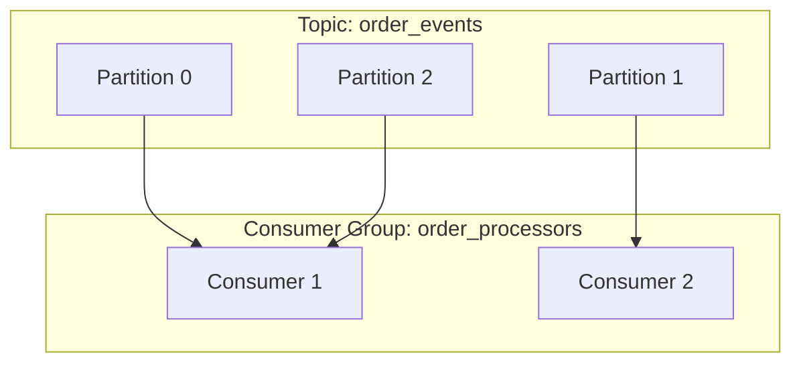
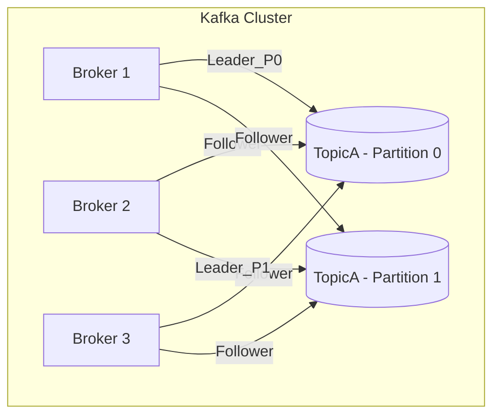
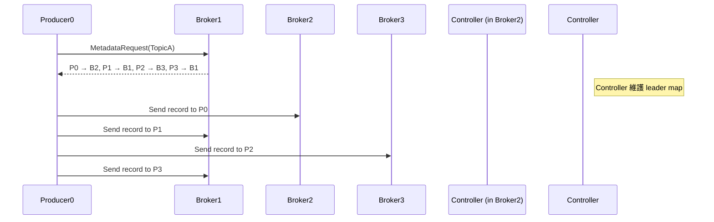

# 🧩 Kafka Topic & Partition 概念說明

## 📦 Topic 是什麼？

在 Kafka 中，**Topic 是訊息的邏輯分類單位**，所有的訊息都被發送到某個特定的 Topic，例如：

- `user_signup`
- `order_events`
- `clickstream`

---

## 🧱 Partition 是什麼？

每個 Topic 被分割為多個 **Partition**，Partition 是 Kafka 的水平擴展與並行處理基礎：

- 每個 Partition 是一條 **有序的 append-only log**
- 訊息在 Partition 中會依照寫入順序被編號（offset）
- 不同 Partition 可由不同 broker/consumer 處理，實現高併發

---

## 🧠 為什麼要分 Partition？

| 目的         | 好處                                                 |
|--------------|------------------------------------------------------|
| 高可用       | 不同 Partition 可分佈到不同 Kafka Broker           |
| 水平擴展     | 較多 Consumer 可平行處理訊息，提高吞吐量           |
| 提高容錯能力 | Partition 可設 Replica，某台 Broker 掛掉也能恢復   |

---

## 🎯 舉例說明

假設一個 Topic 有 3 個 Partition，而一個 Consumer Group 有 2 個 Consumer：

---
## Broker & Partition

---
