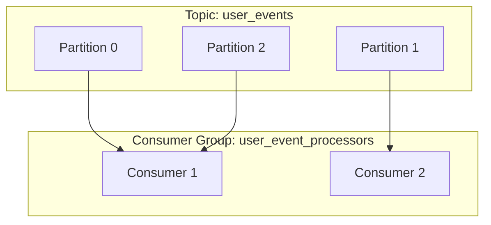
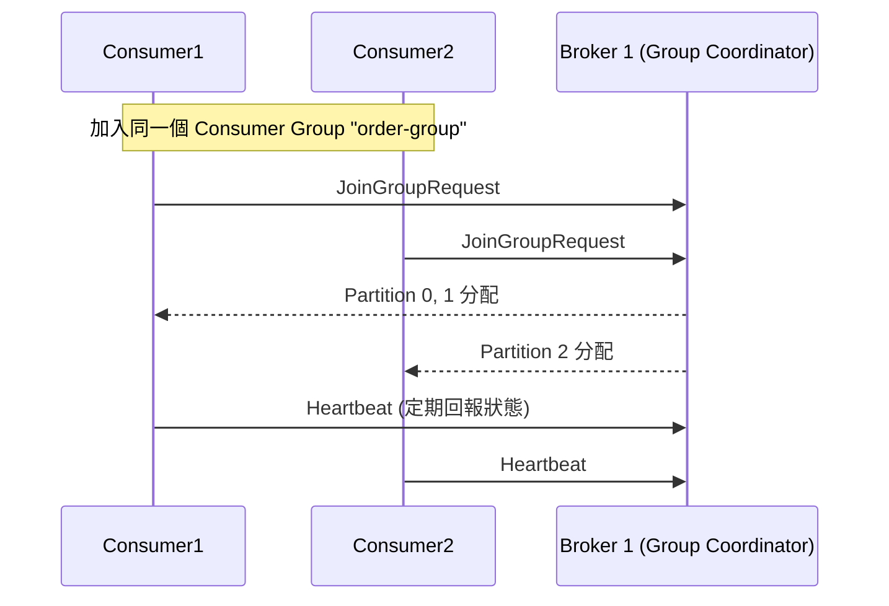
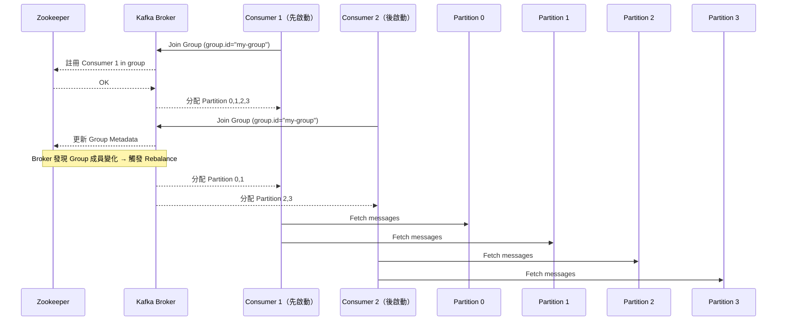

# 👥 Kafka Consumer Group 詳解

Kafka 中的 **Consumer Group** 是實現**水平擴展、容錯處理**與**可追蹤性**的核心機制之一。本文件將說明其運作方式、設計優勢與實務應用場景。

---

## 🧠 基本概念

- **Consumer Group** 是由多個 Consumer 組成的群組，用來**共同處理某個 Topic 的訊息**。
- **Partition 是不可共享的**，在同一個 Consumer Group 裡，一個 Partition 同一時間只能被一個 Consumer 消費。
- Kafka 保證 **每筆訊息只被 Group 中的一個 Consumer 消費一次**。

---

## 🔁 Consumer Group 如何分配 Partition

---

--- 

## 同一 Group 同時兩個 Consumer consume  Partition 流程

