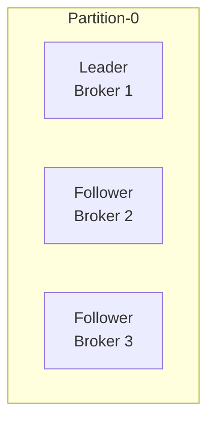
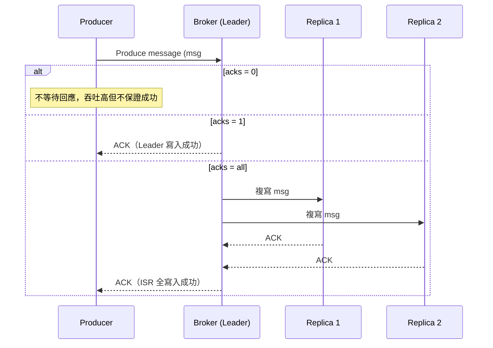

# 🔁 Kafka Replication & Durability 說明

Kafka 的資料複寫（Replication）與耐久性（Durability）設計，是其高可用與高可靠性的核心。

---

## 📦 資料複寫（Replication）

### 🔧 機制說明

- Kafka 中每個 **Topic Partition** 可以設定副本數（replication factor）。
- Kafka 會將資料複寫到多個 **Broker 節點**，其中一個為 **Leader**，其餘為 **Follower（Replica）**。
- 所有讀寫操作都由 Leader 處理，Follower 只負責同步資料。



---

## ✍️ Producer 寫入過程



---

## ✅ 高可靠性設定建議（高可用架構）

## 🧑‍💻 Producer 端配置（Producer Config）

| 參數名稱           | 說明                                                                                 |
|--------------------|--------------------------------------------------------------------------------------|
| `acks`             | 設定 Producer 是否等待 ACK 回應。<br>選項：<br>• `0`：不等待（高效但不保證傳送）<br>• `1`：等待 Leader ACK（基本耐久）<br>• `all`：等待所有 ISR ACK（最高保證） |
| `retries`          | 發送失敗時自動重試的次數                                                             |
| `enable.idempotence` | 啟用幂等性（避免重送造成重複寫入）                                                |
| `linger.ms`        | 發送前等待時間，允許累積更多訊息進行批次發送                                         |
| `batch.size`       | 批次緩衝區大小（Bytes）                                                              |

---

## 🏢 Broker / Topic 層級配置（非 Producer 控制）

| 參數名稱                      | 說明                                                                 |
|-------------------------------|----------------------------------------------------------------------|
| `replication.factor`          | 每個 topic partition 的副本數量（建立 topic 時設定）               |
| `min.insync.replicas`         | 寫入成功所需的最小同步副本數（Leader + Followers）                 |
| `unclean.leader.election.enable` | 是否允許非同步副本成為 Leader（預設 false）                     |
| `default.replication.factor`  | Topic 預設副本數（可於 broker 層級設定）                            |

---

## 🔐 高耐久寫入條件（Strong Durability）

若欲實現「強耐久性」，推薦以下搭配設定：

### ✅ Producer 設定
```properties
acks=all
enable.idempotence=true
retries=5
```