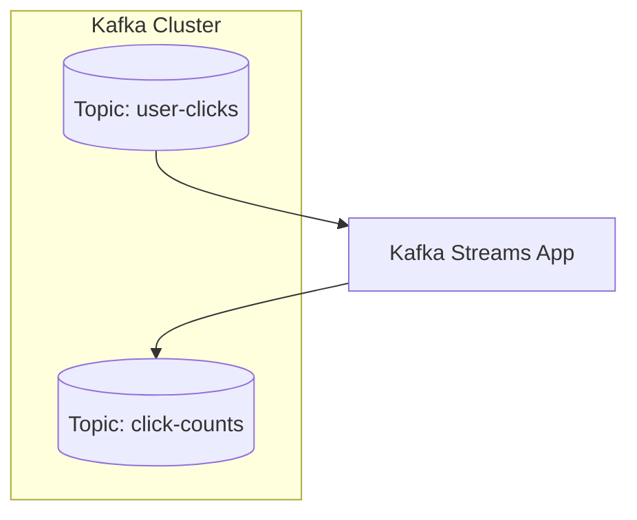

# Kafka Stream & Kafka Connect

Kafka 除了作為訊息中介系統（Message Broker），也內建了兩個重要的資料處理與整合工具：

- **Kafka Streams API**：專為開發即時資料處理流程而設計的函式庫
- **Kafka Connect**：專為資料流入流出 Kafka 的外部系統連接器平台

---

## 1. Kafka Streams 是什麼？

Kafka Streams 是一個 **Java 函式庫**，可用來處理、轉換、聚合 Kafka topic 中的資料流，**直接在應用程式中做 stream 處理**。

### 🎯 特點

- **內建狀態管理**（使用 RocksDB）
- **支援窗口（windowing）、聚合、join 等轉換操作**
- **可以產生新的 topic 作為處理結果**
- 無需部署額外服務，直接嵌入應用程式（JVM）

### 🧭 資料流程示意（Kafka Streams）

