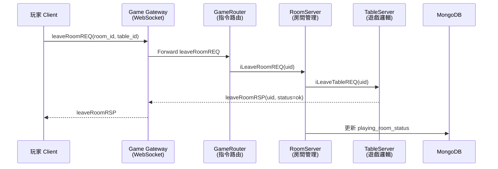

# 🚪 leaveRoomREQ 玩家離開房間流程

此文件描述玩家在德州撲克遊戲中送出 `leaveRoomREQ` 指令後，系統如何處理該請求並維持狀態一致性。

---

## 🔁 流程圖：玩家離開房間

```mermaid
sequenceDiagram
    participant Client as 玩家 Client
    participant Gateway as Game Gateway<br/>(WebSocket)
    participant GameRouter as GameRouter<br/>(指令路由)
    participant Room as RoomServer<br/>(房間管理)
    participant Table as TableServer<br/>(遊戲邏輯)
    participant Mongo as MongoDB

    %% 玩家送出離開請求
    Client->>Gateway: leaveRoomREQ(room_id, table_id)

    %% Gateway 將指令轉發至 GameRouter
    Gateway->>GameRouter: Forward leaveRoomREQ

    %% GameRouter 根據快取或 Mongo 查找 RoomServer instance
    GameRouter->>Room: iLeaveRoomREQ(uid)

    %% RoomServer 更新記憶體與 table mapping 狀態
    Room->>Table: iLeaveTableREQ(uid)

    %% TableServer 處理離桌並直接回應 Gateway
    Table-->>Gateway: leaveRoomRSP(uid, status=ok)
    Gateway-->>Client: leaveRoomRSP

    %% RoomServer 同步更新持久層
    Room->>Mongo: 更新 playing_room_status
```