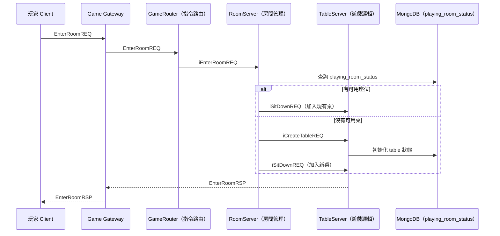

# Matchmaking 自動配桌流程

當玩家進入房間（EnterRoomREQ）後，RoomServer 將根據當前桌子使用狀況、自訂條件（如 VIP、盲注等）進行自動配桌。此流程在 Ring Game 中尤為關鍵，可確保桌子資源最佳化使用並減少等待時間。

---

## 🎯 設計目標

- 動態分配玩家至已有桌子（優先坐滿）
- 若無可用座位，自動建立新桌子
- 保證玩家體驗順暢、支援大量併發進入

---

## 🌐 流程圖（Matchmaking）

