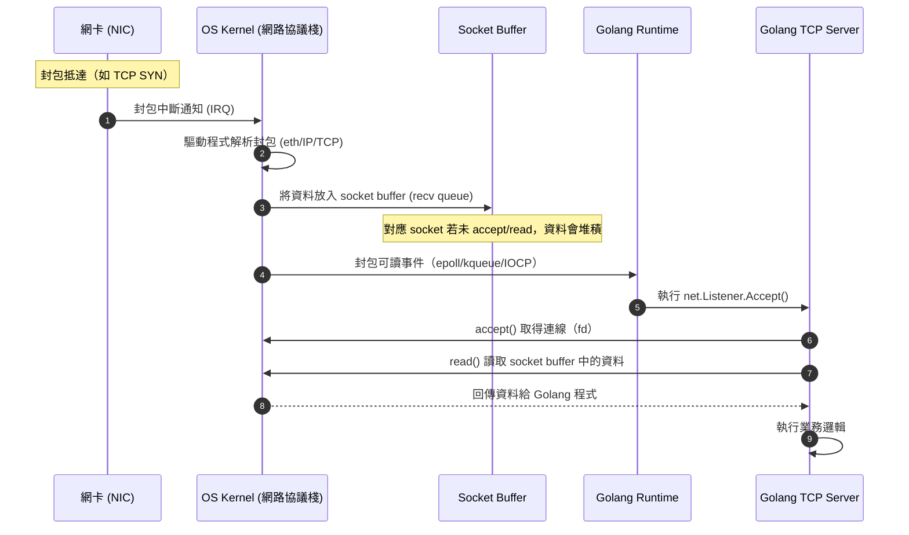

```mermaid
sequenceDiagram
    autonumber
    participant NIC as 網卡 (NIC)
    participant Kernel as OS Kernel (網路協議棧)
    participant Sock as Socket Buffer
    participant GoRuntime as Golang Runtime
    participant App as Golang TCP Server

    Note over NIC: 封包抵達（如 TCP SYN）
    NIC->>Kernel: 封包中斷通知 (IRQ)
    Kernel->>Kernel: 驅動程式解析封包 (eth/IP/TCP)
    Kernel->>Sock: 將資料放入 socket buffer (recv queue)
    Note over Sock: 對應 socket 若未 accept/read，資料會堆積

    Kernel->>GoRuntime: 封包可讀事件（epoll/kqueue/IOCP）
    GoRuntime->>App: 執行 net.Listener.Accept()
    App->>Kernel: accept() 取得連線（fd）
    App->>Kernel: read() 讀取 socket buffer 中的資料
    Kernel-->>App: 回傳資料給 Golang 程式
    App->>App: 執行業務邏輯
```