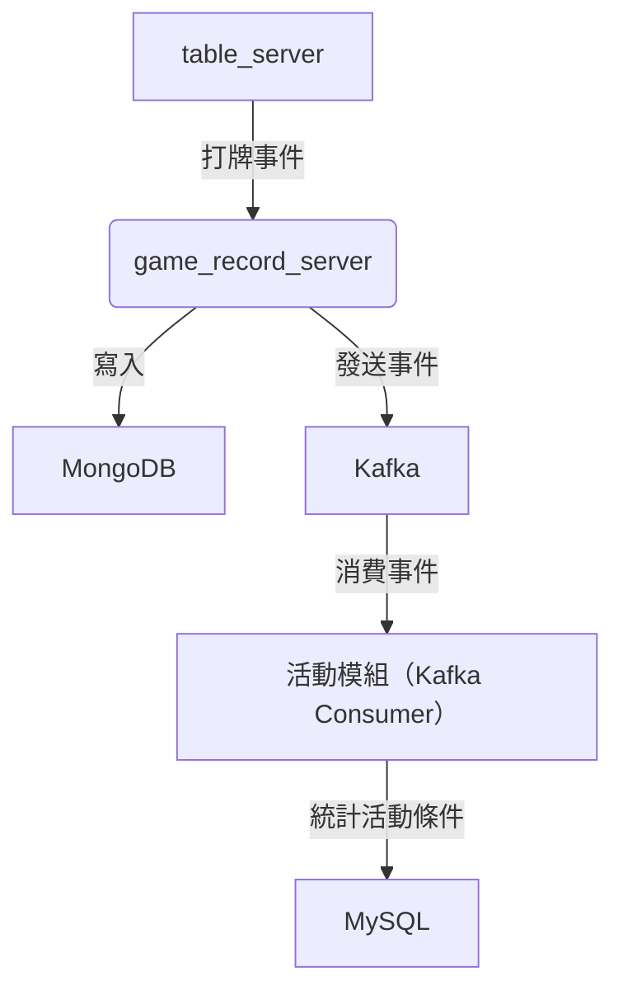
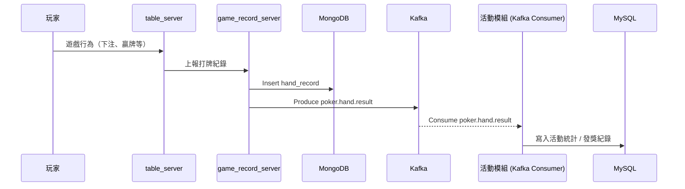

## 事件驅動活動模組架構說明

本文件描述遊戲系統中如何透過事件驅動（Event-Driven）架構，解耦遊戲與活動模組。打牌事件經由 Kafka 發送，活動模組訂閱並處理以達成統計與獎勵目的。

---

## 🎯 核心理念：事件驅動（Event Driven）

- 遊戲邏輯（打牌、結算）不直接依賴活動模組。
- 將「打牌結果」轉換為事件，由 Kafka 廣播，任何模組可訂閱處理。
- 活動模組僅需負責解析事件、更新統計與發獎狀態。
- 可擴展：後續增加排行榜、成就等模組無需修改原有服務。

--- 
## 架構圖

---

## 🔁 整體流程圖：事件驅動活動模組
