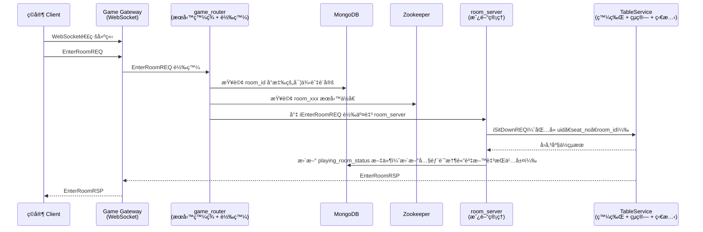

# EnterRoomREQ 進房請求處ç†æµç¨‹

本文件æè¿°ç©å®¶é€²å…¥å¾·å·æ’²å…‹æˆ¿é–“時的整體æµç¨‹ï¼Œæ¶µè“‹æŒ‡ä»¤å‚³éã€æˆ¿é–“路由ã€åº§ä½åˆ†é…與å›æ‡‰é‚輯。é€é game_router 解耦 Gateway 與 room_server，並é…åˆæœå‹™ç™¼ç¾èˆ‡è³‡æ–™æŒä¹…化é”æˆé«˜å¯ç”¨èˆ‡å¯è§€å¯Ÿæ€§ã€‚

---

## 🯠æ¶æ§‹è¨­è¨ˆç›®æ¨™

- 🧭 game_router 負責進房指令統一入å£èˆ‡æœå‹™å®šä½
- 🠠room_server 進行座ä½é‚輯ã€èˆ‡ Table å”åŒå·¥ä½œ
- 🧠 Mongo 為房間狀態的æŒä¹…化來æº
- 🲠Table æœå‹™å°ˆæ³¨æ–¼éŠæˆ²ç‹€æ…‹èˆ‡ç©å®¶ç®¡ç†
- 🯠ç©å®¶æœ€çµ‚ç”± Table æœå‹™å›æ‡‰çµæœ

---

## 🧩 請求æµç¨‹åœ–

```mermaid
sequenceDiagram
    participant Client as ç©å®¶ Client
    participant Gateway as Game Gateway<br/>(WebSocket)
    participant game_router as game_router<br/>(æœå‹™ç™¼ç¾ + 轉發)
    participant Mongo as MongoDB
    participant ZK as Zookeeper
    participant Room as room_server<br/>(房間管ç†)
    participant Table as TableService<br/>(發牌 + çµç®— + 狀態)

    %% ç©å®¶é€£ç·šä¸¦é€å‡ºè«‹æ±‚
    Client->>Gateway: WebSocket連線建立
    Client->>Gateway: EnterRoomREQ

    %% Gateway 轉發請求給 game_router
    Gateway->>game_router: EnterRoomREQ 轉發

    %% game_router 查詢 Mongo 確èªæˆ¿é–“資訊
    game_router->>Mongo: 查詢 room_id å°æ‡‰çš„實例與設定

    %% game_router é€é Zookeeper 找到 room_server 實例
    game_router->>ZK: 查詢 room_xxx æœå‹™ä½å€
    game_router->>Room: 將 iEnterRoomREQ 轉交至 room_server

    %% room_server 處ç†åº§ä½åˆ†é…並建立/指派 Table
    Room->>Table: iSitDownREQï¼ˆåŒ…å« uidã€seat_noã€room_id）

    %% Table å›å‚³å…¥æ¡Œè³‡è¨Šï¼ˆå¦‚ table_id, seat_no）
    Table-->>Room: å›å‚³åº§ä½çµæœ
    Room->>Mongo: æ›´æ–° playing_room_status 文件（更新內部記憶體資料至æŒä¹…層）

    %% ✅ TableService 最終直æ¥å›å‚³çµæœçµ¦ Gateway
    Table-->>Gateway: EnterRoomRSP
    Gateway-->>Client: EnterRoomRSP
```