# 🎯 table_server 心跳監控與災難復原流程

本文件描述 table_server 的狀態維護機制，包含定期回報存活資訊、room_server 的健康檢查，以及當 Table 異常掉線時的災難自動恢復機制。此設計確保每張桌子在高可用場景下皆具備自我修復能力。

---

## 🔄 流程總覽

```mermaid
sequenceDiagram
    participant Table as table_server
    participant Redis as Redis
    participant Room as room_server
    participant NewTable as Recovery table_server

    Note over Table: 每分鐘進行一次心跳回報

    Table->>Redis: SET table_alive:table_123 = "table_svr_1" EX 90

    Note over Room: 每 30 秒檢查桌子狀態
    Room->>Redis: EXISTS table_alive:table_123

    alt Redis key 存在
        Note over Room: 桌子仍存活，無需處理
    else Redis key 不存在
        Note over Room: 偵測不到心跳，進行健康檢查

        Room->>Table: HealthCheck(table_123)
        alt 有回應
            Note over Room: 判定為暫時異常，忽略
        else 無回應
            Note over Room: 重試 2 次皆失敗
            Note over Room: 啟動災難恢復流程

            Room->>NewTable: recovery_table(table_123)
            NewTable->>Redis: 讀取 table_state:table_123
            NewTable->>Redis: SET table_alive:table_123 = "new_table_svr" EX 90
            NewTable-->>Room: 回覆已完成復原
        end
    end
```

