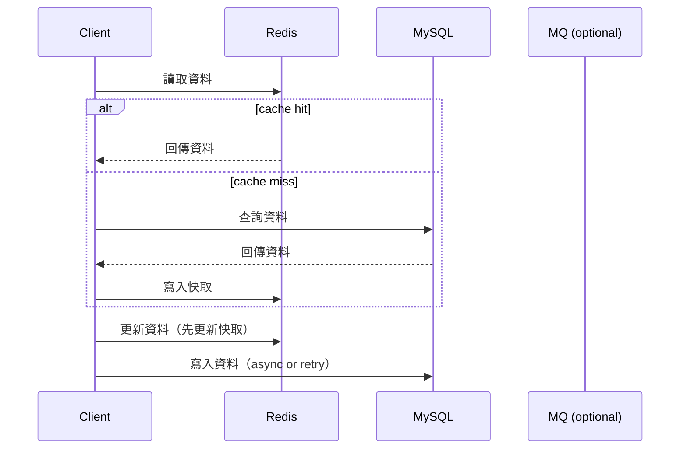

```mermaid
sequenceDiagram
    participant Client
    participant Redis
    participant MySQL
    participant MQ (optional)

    Client->>Redis: 讀取資料
    alt cache hit
        Redis-->>Client: 回傳資料
    else cache miss
        Client->>MySQL: 查詢資料
        MySQL-->>Client: 回傳資料
        Client->>Redis: 寫入快取
    end

    Client->>Redis: 更新資料（先更新快取）
    Client->>MySQL: 寫入資料（async or retry）
```