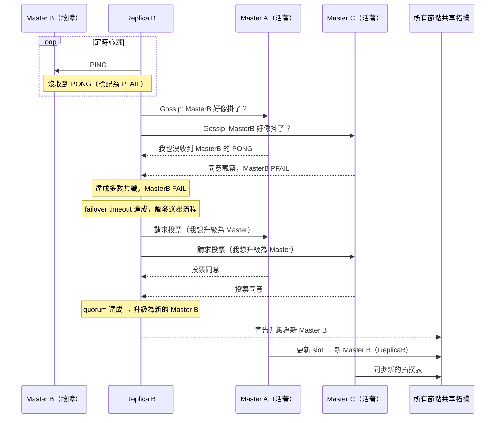
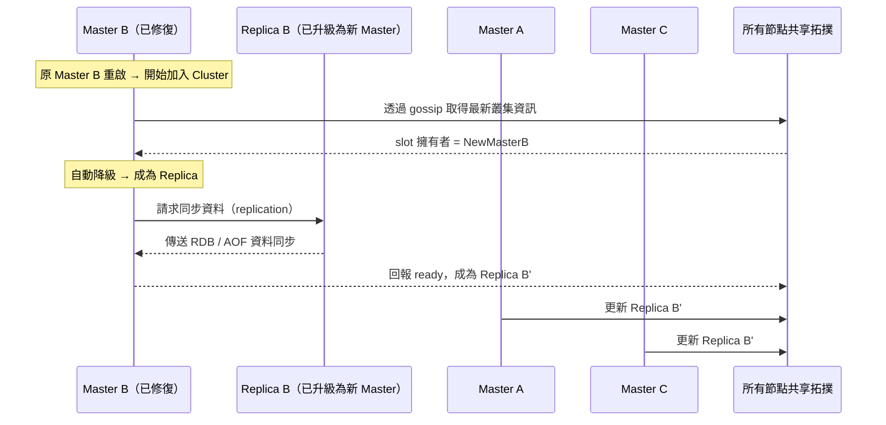

## 🔁 主節點故障時的 Failover 流程

``` mermaid
sequenceDiagram
    participant MasterB as Master B（故障）
    participant ReplicaB as Replica B
    participant MasterA as Master A（活著）
    participant MasterC as Master C（活著）
    participant Cluster as 所有節點共享拓撲

    %% 1. Replica B 進行 PING 檢測
    loop 定時心跳
        ReplicaB->>MasterB: PING
        Note over ReplicaB,MasterB: 沒收到 PONG（標記為 PFAIL）
    end

    %% 2. Gossip 機制交換觀察
    ReplicaB->>MasterA: Gossip: MasterB 好像掛了？
    ReplicaB->>MasterC: Gossip: MasterB 好像掛了？
    MasterA-->>ReplicaB: 我也沒收到 MasterB 的 PONG
    MasterC-->>ReplicaB: 同意觀察，MasterB PFAIL

    %% 3. 達成共識認定 MasterB 為 FAIL
    Note over ReplicaB: 達成多數共識，MasterB FAIL
    Note over ReplicaB: failover timeout 達成，觸發選舉流程

    %% 4. 發送升級為 Master 的請求
    ReplicaB->>MasterA: 請求投票（我想升級為 Master）
    ReplicaB->>MasterC: 請求投票（我想升級為 Master）

    %% 5. 其他 Master 節點確認 B 已失效
    MasterA-->>ReplicaB: 投票同意
    MasterC-->>ReplicaB: 投票同意

    %% 6. Replica B 取得過半數票數（2/3）
    Note over ReplicaB: quorum 達成 → 升級為新的 Master B
    ReplicaB-->>Cluster: 宣告升級為新 Master B

    %% 7. 其他節點更新拓撲資訊
    MasterA->>Cluster: 更新 slot → 新 Master B（ReplicaB）
    MasterC->>Cluster: 同步新的拓撲表
```

--- 
## 🛠️ 修復故障 Master 並降級為 Replica

```mermaid
sequenceDiagram
    participant OldMasterB as Master B（已修復）
    participant NewMasterB as Replica B（已升級為新 Master）
    participant MasterA as Master A
    participant MasterC as Master C
    participant Cluster as 所有節點共享拓撲

    %% 1. Master B 修復並重新啟動
    Note over OldMasterB: 原 Master B 重啟 → 開始加入 Cluster
    OldMasterB->>Cluster: 透過 gossip 取得最新叢集資訊

    %% 2. 發現自己不是 slot 擁有者，已有新的 Master（Replica B）
    Cluster-->>OldMasterB: slot 擁有者 = NewMasterB

    %% 3. OldMasterB 重新加入為 Replica
    Note over OldMasterB: 自動降級 → 成為 Replica
    OldMasterB->>NewMasterB: 請求同步資料（replication）

    %% 4. 完成同步，正式加入叢集
    NewMasterB-->>OldMasterB: 傳送 RDB / AOF 資料同步
    OldMasterB-->>Cluster: 回報 ready，成為 Replica B'

    %% 5. 所有節點更新拓撲
    MasterA->>Cluster: 更新 Replica B'
    MasterC->>Cluster: 更新 Replica B'
```