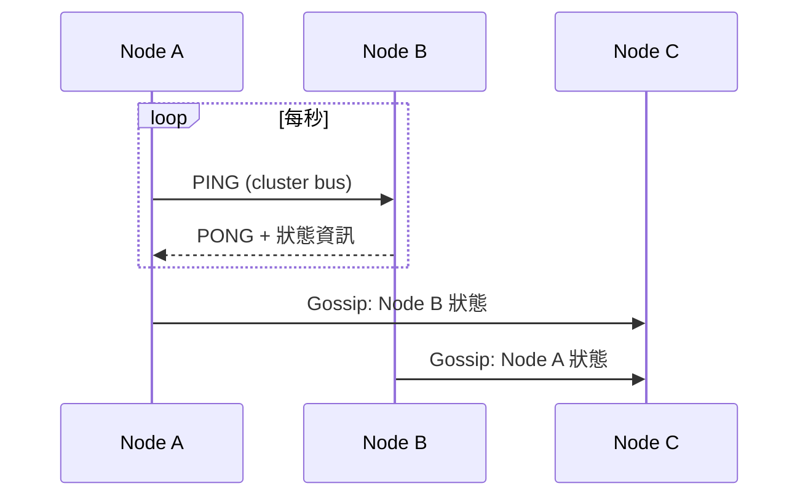

## 🧪 節點偵測流程 (Decentralization)

Redis Cluster 的 Gossip 就像「耳語網」，每個節點會：
- 隨機「打聽」某個節點的狀況（ping）
- 然後將這些「聽來的消息」再傳給別人
- 最後所有人拼湊出整個 cluster 的狀態拓撲（topology）

```mermaid
sequenceDiagram
    participant A as Node A
    participant B as Node B
    participant C as Node C

    %% 週期性交換狀態
    loop 每秒
        A->>B: PING (cluster bus)
        B-->>A: PONG + 狀態資訊
    end

    %% 傳遞第三方觀察
    A->>C: Gossip: Node B 狀態
    B->>C: Gossip: Node A 狀態

    %% C 接收來自不同節點的資訊，更新本地節點狀態表
```