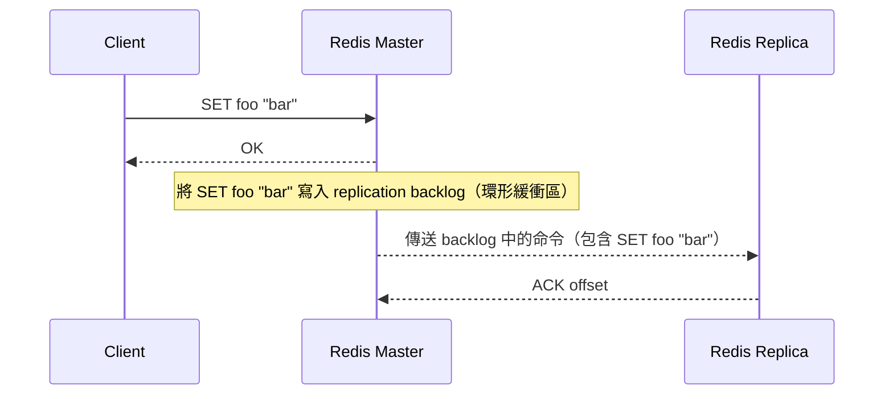

## 📜 Redis Master-Replica 同步過程 (eventaul consistency)

```mermaid
sequenceDiagram
    participant Client
    participant Master as Redis Master
    participant Replica as Redis Replica

    Client->>Master: SET foo "bar"
    Master-->>Client: OK

    Note over Master: 將 SET foo "bar" 寫入 replication backlog（環形緩衝區）
    Master-->>Replica: 傳送 backlog 中的命令（包含 SET foo "bar"）
    Replica-->>Master: ACK offset
```