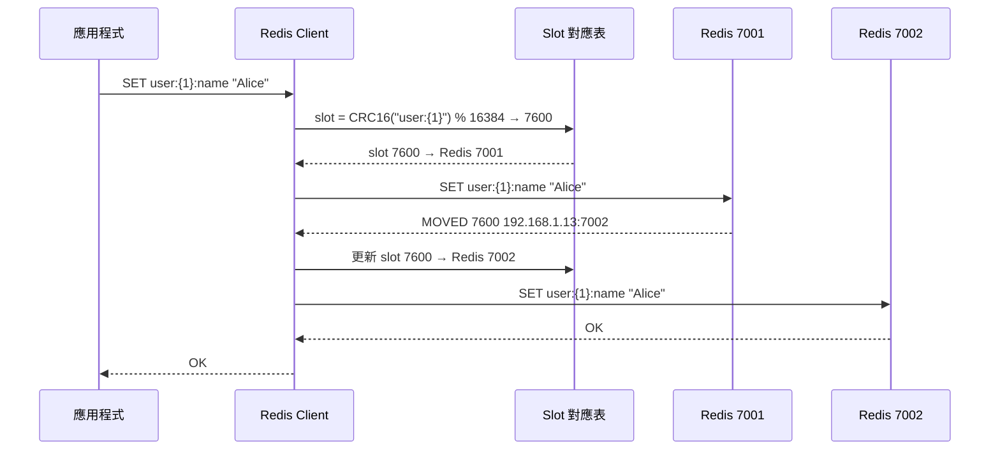
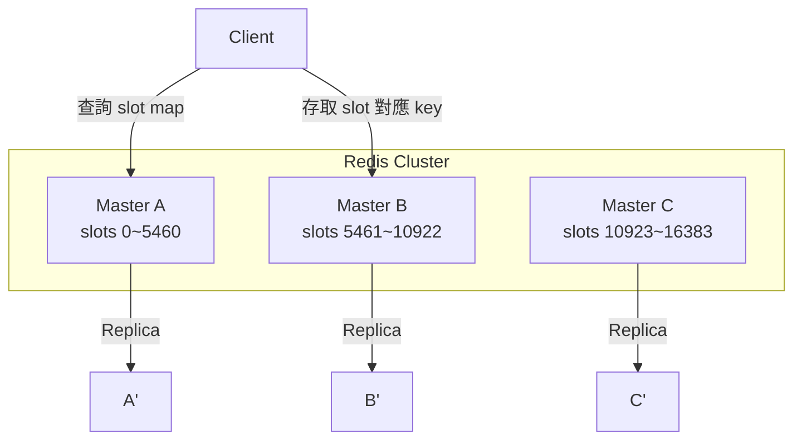

## 🧠 實際操作流程：Sharding Write

```mermaid
sequenceDiagram
    participant App as 應用程式
    participant Client as Redis Client
    participant SlotMap as Slot 對應表
    participant Redis7001 as Redis 7001
    participant Redis7002 as Redis 7002

    App->>Client: SET user:{1}:name "Alice"
    Client->>SlotMap: slot = CRC16("user:{1}") % 16384 → 7600
    SlotMap-->>Client: slot 7600 → Redis 7001
    Client->>Redis7001: SET user:{1}:name "Alice"
    Redis7001-->>Client: MOVED 7600 192.168.1.13:7002
    Client->>SlotMap: 更新 slot 7600 → Redis 7002
    Client->>Redis7002: SET user:{1}:name "Alice"
    Redis7002-->>Client: OK
    Client-->>App: OK
```
--- 
## 🗺️ Cluster Slot Mapping 結構 

``` mermaid
flowchart TD
    subgraph Redis Cluster
        A[Master A<br/>slots 0~5460]
        B[Master B<br/>slots 5461~10922]
        C[Master C<br/>slots 10923~16383]
    end
    A -->|Replica| A'
    B -->|Replica| B'
    C -->|Replica| C'

    Client -->|查詢 slot map| A
    Client -->|存取 slot 對應 key| B
```