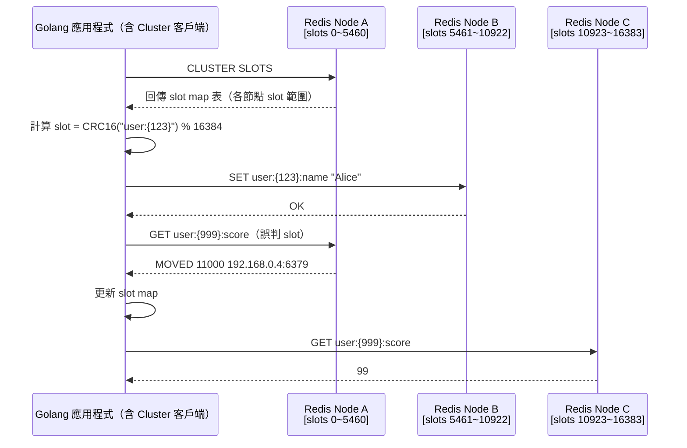

## 🧠 實際操作流程：Sharding Write

```mermaid
sequenceDiagram
    participant App as Golang 應用程式（含 Cluster 客戶端）
    participant NodeA as Redis Node A<br/>[slots 0~5460]
    participant NodeB as Redis Node B<br/>[slots 5461~10922]
    participant NodeC as Redis Node C<br/>[slots 10923~16383]

    %% 第一次初始化 slot map
    App->>NodeA: CLUSTER SLOTS
    NodeA-->>App: 回傳 slot map 表（各節點 slot 範圍）

    %% 正常存取流程
    App->>App: 計算 slot = CRC16("user:{123}") % 16384
    App->>NodeB: SET user:{123}:name "Alice"
    NodeB-->>App: OK

    %% Slot map 錯誤時
    App->>NodeA: GET user:{999}:score（誤判 slot）
    NodeA-->>App: MOVED 11000 192.168.0.4:6379
    App->>App: 更新 slot map
    App->>NodeC: GET user:{999}:score
    NodeC-->>App: 99
```