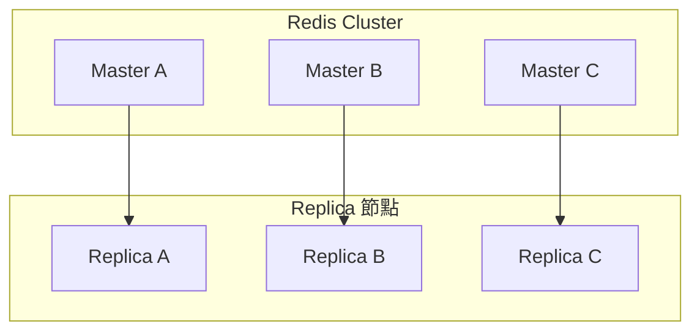
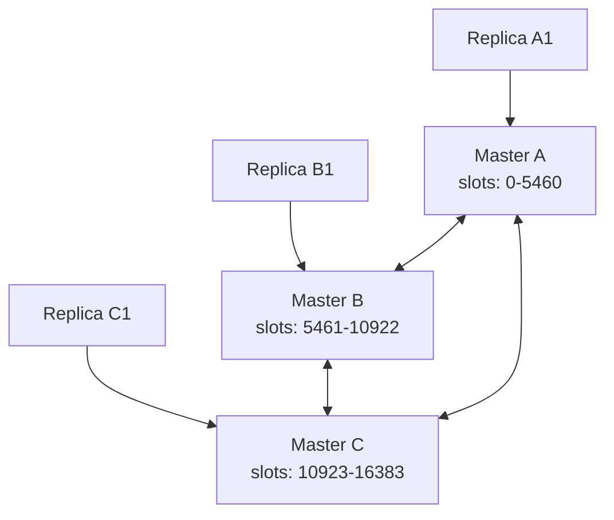

# 🚀 Redis Cluster 架構說明與高可用策略

本文件說明 Redis Cluster 如何透過 slot 分配、節點複製與高可用設計達到擴展性與容錯性，並探討其在三個主實例架構下的效能優勢。

---

## 🧱 基礎概念：Redis Cluster 是什麼？

Redis Cluster 是 Redis 提供的原生分散式部署解決方案，具備以下能力：

- 將資料分散儲存在多台 Redis 節點中（**水平擴展**）
- 可設定主從架構，實現故障自動轉移（**高可用性**）
- 每筆資料定位不需透過中心 proxy，而是透過 **hash slot** 快速映射

---

---

## 🧭 Mermaid 拓撲同步流程圖
