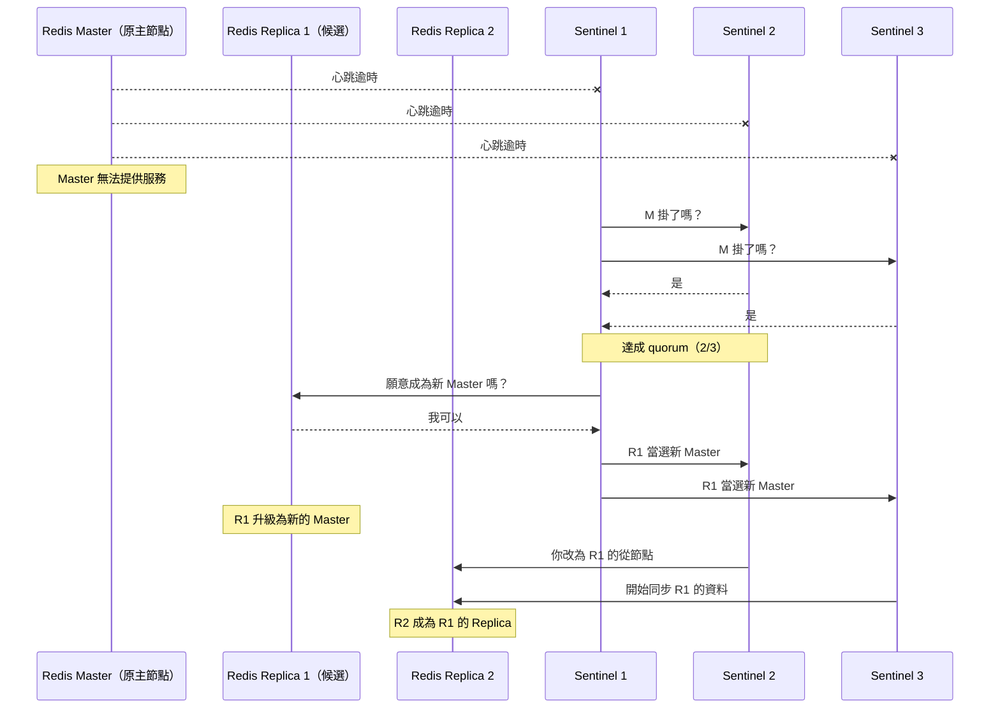

## 🗳️ Redis Sentinel 選舉與故障轉移流程

```mermaid
sequenceDiagram
    participant M as Redis Master（原主節點）
    participant R1 as Redis Replica 1（候選）
    participant R2 as Redis Replica 2
    participant S1 as Sentinel 1
    participant S2 as Sentinel 2
    participant S3 as Sentinel 3

    %% 1. Master 掛掉，無法回應心跳
    M--X S1: 心跳逾時
    M--X S2: 心跳逾時
    M--X S3: 心跳逾時
    Note over M: Master 無法提供服務

    %% 2. Sentinels 相互確認 Master 狀態
    S1->>S2: M 掛了嗎？
    S1->>S3: M 掛了嗎？
    S2-->>S1: 是
    S3-->>S1: 是
    Note over S1,S2: 達成 quorum（2/3）

    %% 3. 觸發選舉流程，提名 Replica R1
    S1->>R1: 願意成為新 Master 嗎？
    R1-->>S1: 我可以

    %% 4. 宣告 R1 為新 Master，並通知其他節點
    S1->>S2: R1 當選新 Master
    S1->>S3: R1 當選新 Master
    Note over R1: R1 升級為新的 Master

    %% 5. 其他 Replica 調整從屬關係
    S2->>R2: 你改為 R1 的從節點
    S3->>R2: 開始同步 R1 的資料
    Note over R2: R2 成為 R1 的 Replica
```