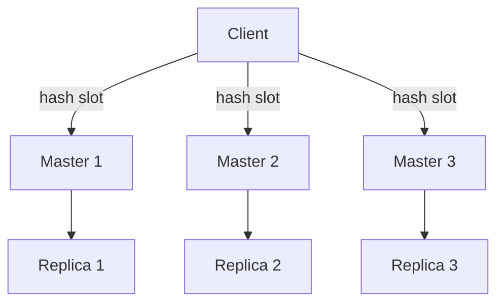
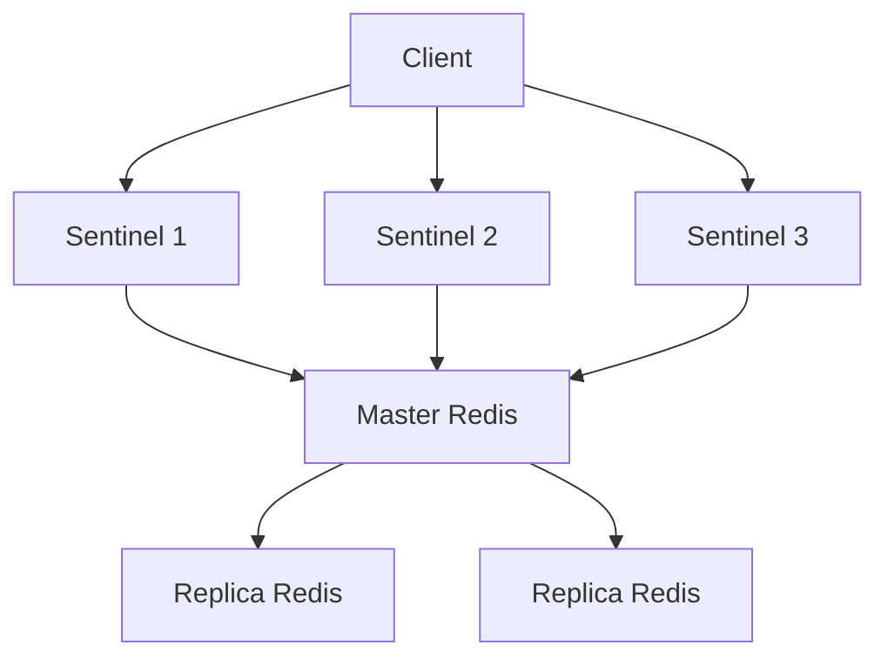

# 🧠 Redis 架構選型指南：Cluster vs Sentinel

## 🚀 Redis Cluster

### ✅ 優點

- **水平擴展（Scalability）**：可透過 slot 機制水平擴展節點數量。
- **自動分片（Sharding）**：每筆資料透過 slot 分配至不同節點，自動負載均衡。
- **無單點（Decentralized）**：所有節點共享拓撲與狀態，不依賴中心代理。
- **自動故障轉移（Failover）**：Replica 節點可自動升級為 Master，保持高可用。
- **適用大資料與高併發應用**。

### 🎯 適合場景

| 應用情境         | 說明                                |
|------------------|-------------------------------------|
| 高流量服務       | 如社群平台、遊戲伺服器             |
| 巨量 Key/Value 儲存 | 單機無法承載大量資料             |
| 分散式架構微服務 | 跨服務共用資料快取                 |
| 自動擴展與高可用 | 雲原生架構或多區部署需求           |

### ❌ 限制與注意

- 不適用分布式鎖等強一致性需求
- 多 key 操作需落在同一 slot（使用 `{}` hash tag）
- 客戶端需支援 cluster 模式與 `MOVED` 指令

---

## 🛡 Redis Sentinel

### ✅ 優點

- **自動主從切換**：Master 掛掉時，自動升級 Replica
- **簡單部署**：適用單例 Redis 架構，設定簡易
- **與 Redis 指令高度相容**
- **適合強一致性用途（如分布式鎖）**

### 🎯 適合場景

| 應用情境     | 說明                                |
|--------------|-------------------------------------|
| 分布式鎖     | 如 SETNX, INCR, MULTI/EXEC 等原子操作 |
| 小型服務     | 單點寫入足夠，仍需高可用保護       |
| 金流 / 任務隊列 | 強一致性與失敗保護優先             |
| 獨立緩存節點 | 某些微服務專用緩存（非共享型態）     |

---

## 🔍 Cluster vs Sentinel 對比總表

| 項目              | Redis Cluster | Redis Sentinel |
|-------------------|----------------|----------------|
| 擴展性            | ✅ 水平擴展    | ❌ 單一主節點  |
| 高可用            | ✅ 自動 Failover | ✅ 自動選主  |
| 資料一致性        | 最終一致性     | 強一致性       |
| 多 key 原子操作   | ⛔ 不建議       | ✅ 支援        |
| 分布式鎖支援      | ⛔ 不適合       | ✅ 適用        |
| 部署複雜度        | ⛔ 高           | ✅ 簡單        |

---

## 🧩 補充圖示

## Redis Cluster 架構

--- 

## Redis Sentinel 架構

