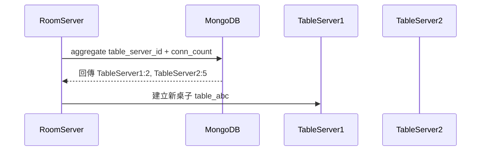

## 🔀 3. Load Balancing（負載平衡）
---

```mermaid
sequenceDiagram
    participant Room as RoomServer
    participant Mongo as MongoDB
    participant Table1 as TableServer1
    participant Table2 as TableServer2

    Room->>Mongo: aggregate table_server_id + conn_count
    Mongo-->>Room: 回傳 TableServer1:2, TableServer2:5
    Room->>Table1: 建立新桌子 table_abc
```