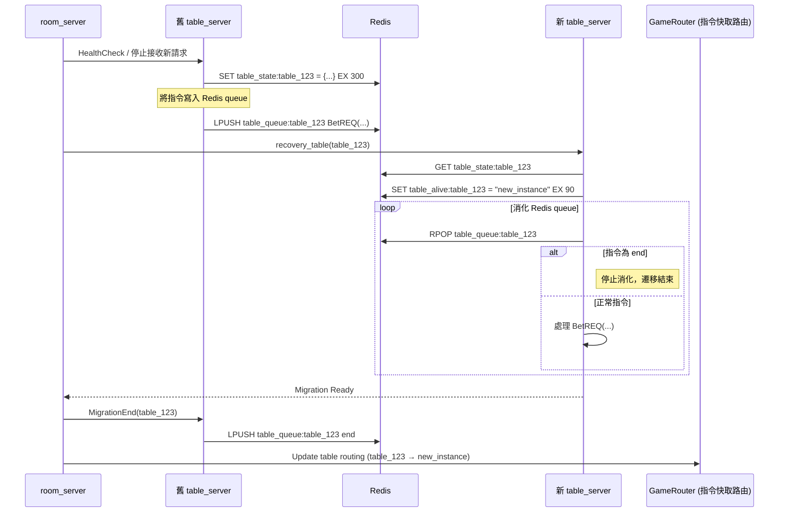

# 🔁 Table Migration 桌子遷移流程設計

當進行 **滾動部署** 或遇到 table_server 發生異常時，room_server 需主動觸發桌子遷移機制，以確保遊戲不中斷並支援狀態復原。以下為完整的流程與設計說明。

---

## 🎯 遷移目標

- ✅ 無縫切換 Table 實例，不中斷玩家遊戲
- ✅ 保留當前遊戲狀態並還原（含 queue 中未處理指令）
- ✅ 自動更新 GameRouter 的 routing 資訊
- ✅ 支援原 Table 緩衝 → 新 Table 消化的轉接機制

---

## 🧭 遷移流程圖

