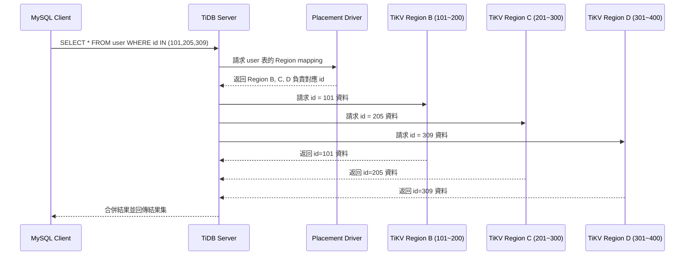

# 01_TiDB_Architecture_Overview

TiDB 是一套分散式的 NewSQL 資料庫，兼具傳統 RDBMS 的 SQL 能力與 NoSQL 的橫向擴展特性，核心設計理念是「擴展性、強一致性、高可用性」。

---

## 🔧 TiDB 架構核心組件

### 1. TiDB Server
- 無狀態 SQL 層，接收 SQL 查詢並轉為 KV 操作。
- 會將請求轉發給 TiKV / TiFlash。
- 可水平擴展，支援 load balancing。

### 2. PD (Placement Driver)
- 集群管理員，負責全域元資料（如 Region 分布與 Leader 分配）。
- 決定資料的調度與平衡。
- 相當於「分布式大腦」。

### 3. TiKV (Key-Value Storage)
- 實際資料儲存的地方，採 Row-based 存儲。
- 資料切分為 Region（每 96MB 一個區塊），由 Raft 保證一致性。
- 每個 Region 有多個副本，並有一個 Leader。

### 4. TiFlash (Columnar Storage)
- 為 OLAP 場景設計，列式儲存，適合分析查詢。
- 與 TiKV 資料同步，支援 MPP 引擎。

---

## 🧱 架構圖（邏輯結構）

```
                    +---------------+
                    |   Client /    |
                    |   MySQL CLI   |
                    +-------+-------+
                            |
                     +------+------+
                     |   TiDB Node  |  <--- SQL Layer (無狀態)
                     +------+------+
                            |
         +------------------+------------------+
         |                                     |
   +-----v-----+                        +------v------+
   |   PD Node |  <--- Placement Driver|   PD Node    |...
   +-----------+                       +-------------+

         +----------------+----------------+
         |                                 |
   +-----v-----+                     +-----v-----+
   |   TiKV    |    <--- Row Store   |   TiKV    |...
   +-----------+                     +-----------+

         +----------------+----------------+
         |                                 |
   +-----v-----+                     +-----v-----+
   | TiFlash   |    <--- Column Store | TiFlash  |...
   +-----------+                     +-----------+
```

---

## 📌 TiDB 與 MySQL 的差異

| 項目         | MySQL                 | TiDB                         |
|--------------|------------------------|-------------------------------|
| 架構         | 單機為主，主從複製     | 天生分散式，多副本強一致性   |
| 擴展性       | 垂直擴充為主            | 水平擴展節點                  |
| 分區策略     | 需手動分庫分表         | 自動 Region 分割與調度       |
| 交易一致性   | 單機強一致，多機依靠應用 | 分散式兩階段提交 + MVCC     |
| OLAP 支援    | 弱                     | TiFlash 強化分析查詢         |

---

## ✅ 適用場景

- 高併發寫入（例如：錢包交易、遊戲事件記錄）
- 混合 OLTP + OLAP 的業務
- 快速彈性擴展的微服務架構
- 雲原生架構、多租戶系統

---
## 客戶端調度流程
