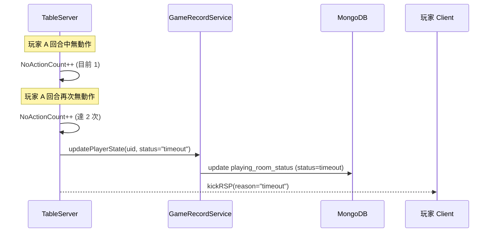

# 🫀 玩家無回應逾時處理流程

此文件說明當玩家在遊戲中輪到回合兩次沒動作系統會自動處理踢出。適用於 Cash Game。

---

```mermaid
sequenceDiagram
    participant Table as TableServer
    participant Record as GameRecordService
    participant Mongo as MongoDB
    participant Client as 玩家 Client

    %% 1. 玩家進入回合但未動作
    Note over Table: 玩家 A 回合中無動作
    Table->>Table: NoActionCount++ (目前 1)

    %% 2. 下一次回合再次未動作
    Note over Table: 玩家 A 回合再次無動作
    Table->>Table: NoActionCount++ (達 2 次)

    %% 3. 判定為 Timeout，通知 GameRecordService
    Table->>Record: updatePlayerState(uid, status="timeout")

    %% 4. GameRecordService 更新資料庫
    Record->>Mongo: update playing_room_status (status=timeout)

    %% 5. 若玩家仍在線，回應通知
    Table-->>Client: kickRSP(reason="timeout")
```