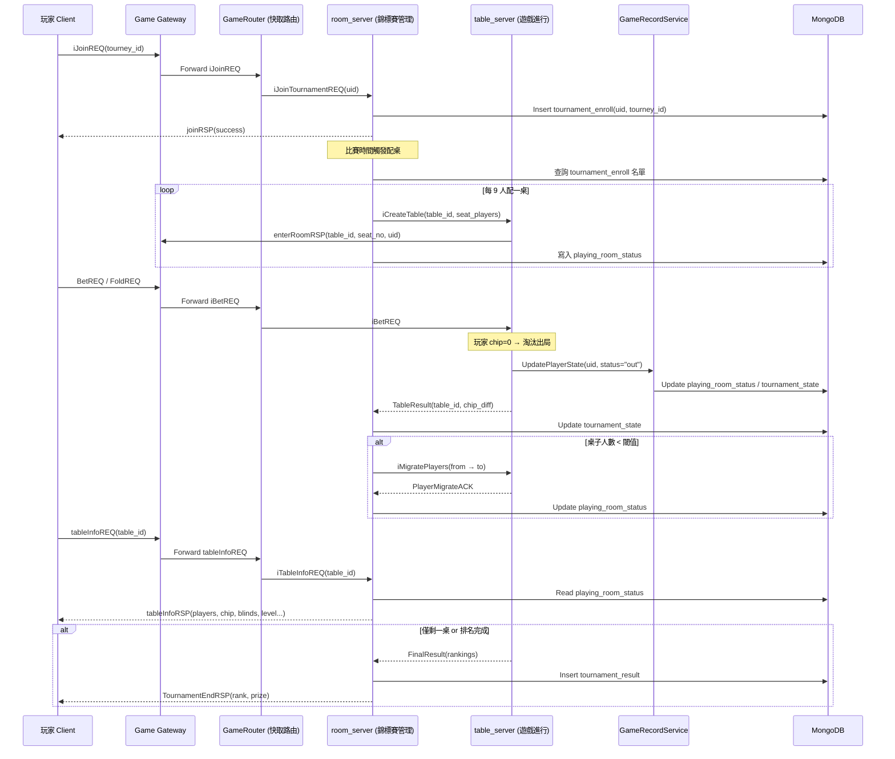
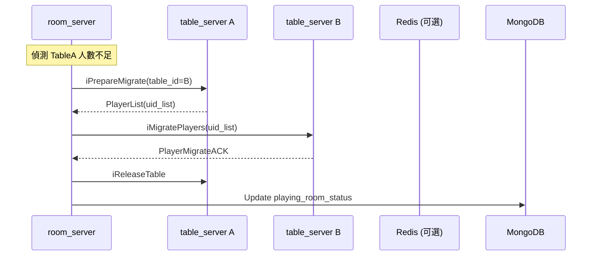

# 🏆 錦標賽流程說明（MTT）

本文件描述多桌錦標賽（MTT, Multi-Table Tournament）從玩家報名、賽事啟動、桌子配置、遊戲進行、桌子合併與最終結算的完整流程。

---

## 🎯 流程特性

- 📝 賽事尚未開始時，玩家報名資料僅寫入 MongoDB
- 🕒 比賽開始時間一到，由 room_server 自動建立 table_server 並將玩家分配入桌
- 🧾 table_server 會主動推送 `enterRoomRSP` 指令讓玩家進桌
- 🔁 當桌子人數過少，room_server 自動觸發合桌遷移（Table Migration）
- 💥 玩家輸光籌碼後，table_server 會通知 GameRecordService 更新遊戲狀態
- 📋 玩家可透過 `tableInfoREQ` 查詢目前桌子狀況
- 🏁 最終由 room_server 統一整理名次與獎勵分配

---

## 🔁 MTT 錦標賽完整流程圖

## 🔁 桌子合併細節流程（TableA → TableB）
