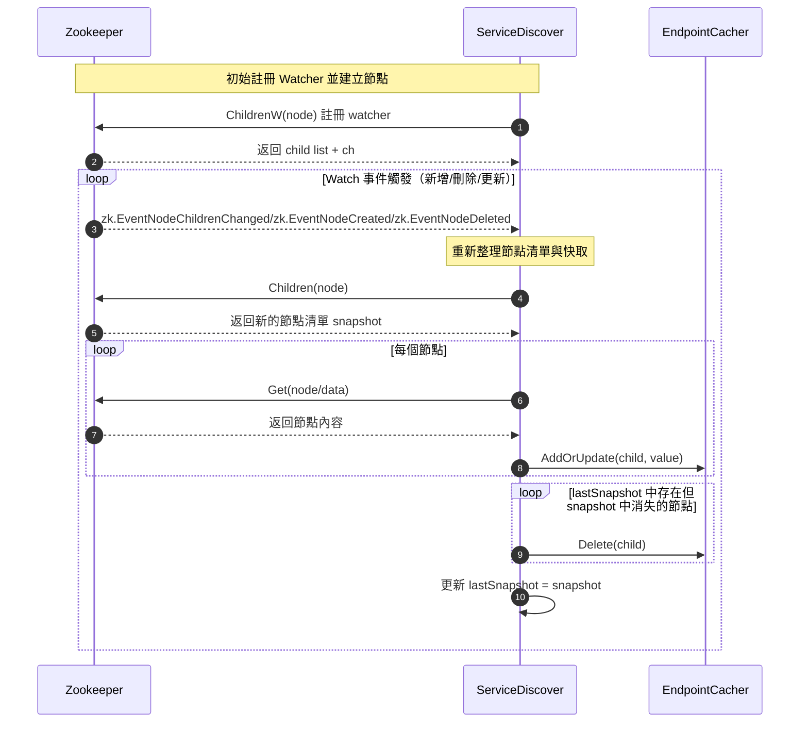

```mermaid
sequenceDiagram
    autonumber
    participant Zookeeper
    participant Discover as ServiceDiscover
    participant Cache as EndpointCacher

    Note over Zookeeper,Discover: 初始註冊 Watcher 並建立節點

    Discover->>Zookeeper: ChildrenW(node) 註冊 watcher
    Zookeeper-->>Discover: 返回 child list + ch

    loop Watch 事件觸發（新增/刪除/更新）
        Zookeeper-->>Discover: zk.EventNodeChildrenChanged/zk.EventNodeCreated/zk.EventNodeDeleted
        Note over Discover: 重新整理節點清單與快取
        
        Discover->>Zookeeper: Children(node)
        Zookeeper-->>Discover: 返回新的節點清單 snapshot

        loop 每個節點
            Discover->>Zookeeper: Get(node/data)
            Zookeeper-->>Discover: 返回節點內容

            Discover->>Cache: AddOrUpdate(child, value)
        end

        loop lastSnapshot 中存在但 snapshot 中消失的節點
            Discover->>Cache: Delete(child)
        end

        Discover->>Discover: 更新 lastSnapshot = snapshot
    end
```