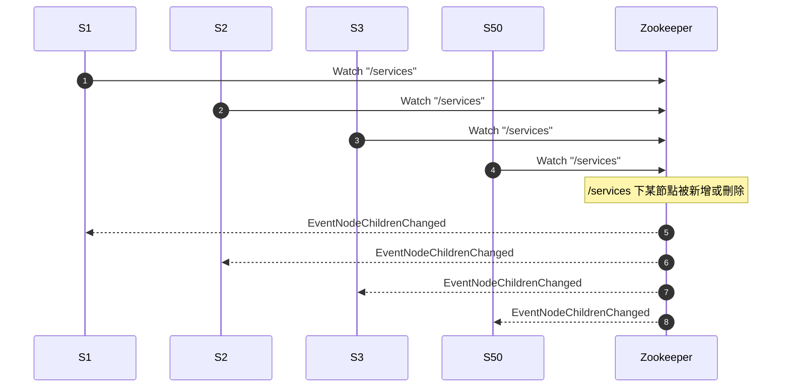
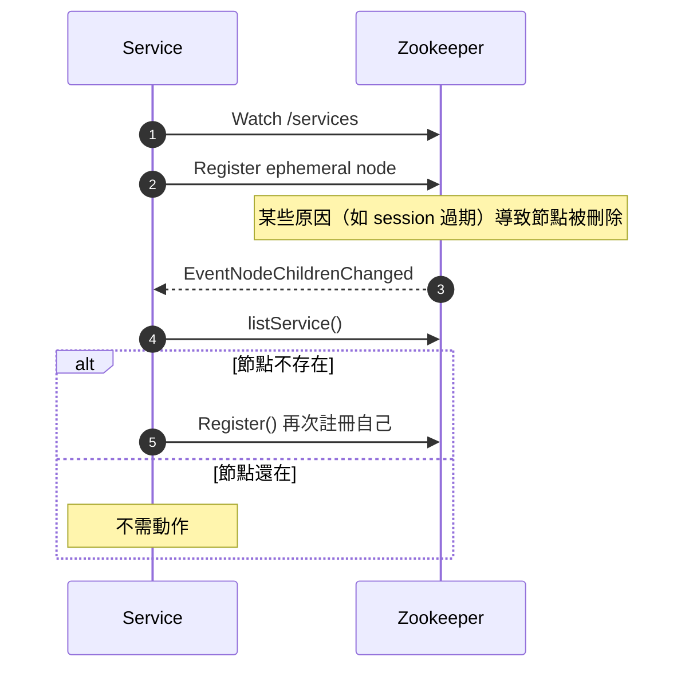

# Zookeeper Watcher Storm 說明與範例

## 問題情境：什麼是 Watcher Storm？

當系統中有大量微服務（例如 50 個以上）都對 Zookeeper 上的某個節點（例如 `/services`）設定 Watch 時，只要該節點有任何變動（新增、刪除、修改子節點），**Zookeeper 就需要對所有註冊 Watch 的 Client 分別觸發事件通知**。

這會導致：
- **大量的事件通知併發發送**（50 個服務全部被觸發）
- **Client 同步執行各自的 Discovery / Refresh / Cache 更新邏輯**
- 如果 Client 還會重新 set watch，就可能造成無窮迴圈

這種情況會造成：
- 高 CPU 使用率
- 大量 GC 開銷（重建物件）
- 整體系統延遲大幅提升

這種效應稱為 **Watcher Storm**。

---

## 示意圖：50 個服務 Watch `/services`，導致事件風暴

---
